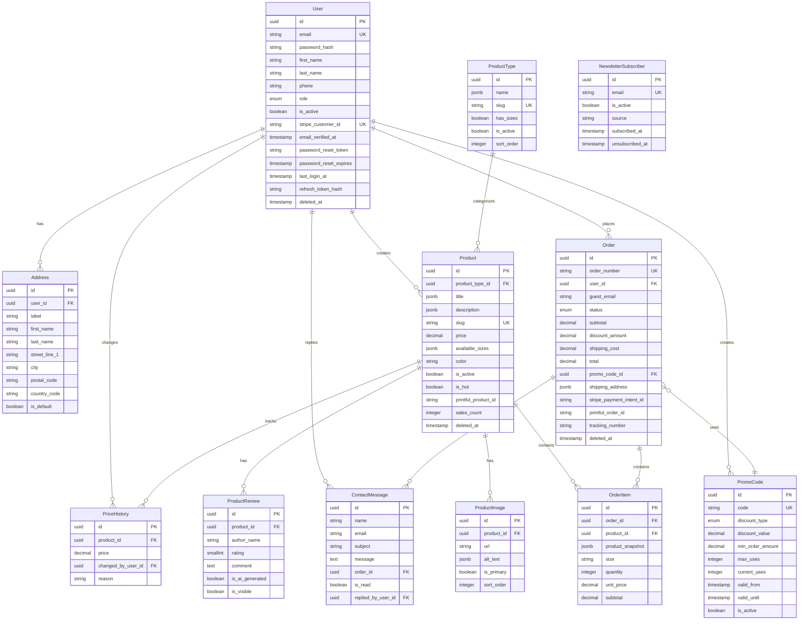

# Data Model Documentation

## 1. Overview

This document describes the data model for the Meme Products E-commerce platform. The database uses PostgreSQL with Prisma ORM for schema management and migrations.

### Design Decisions

| Decision | Choice | Rationale |
|----------|--------|-----------|
| Primary Keys | UUID v4 | Security (non-guessable), distributed-friendly |
| Soft Delete | Yes (for core entities) | Data recovery, audit trail |
| User Structure | Single table with role | Flexibility, simpler queries |
| Product Variants | JSON array for sizes | Uniform pricing, simpler MVP |
| Price History | Tracked | Analytics, order integrity |
| Multi-language | JSON fields | No migrations for new languages |
| Addresses | Hybrid (table + JSON snapshot) | Reusable for users, preserved in orders |

---

## 2. Entity Summary

| Entity | Description | Soft Delete |
|--------|-------------|-------------|
| `User` | All user types (customers, managers, admins, marketing) | Yes |
| `Address` | Saved addresses for registered users | No |
| `ProductType` | Product categories (t-shirt, mug, hoodie, etc.) | No |
| `Product` | Catalog items | Yes |
| `ProductImage` | Product photos and mockups | No |
| `ProductReview` | Product reviews (real or AI-generated) | No |
| `PriceHistory` | Historical price changes | No |
| `PromoCode` | Discount codes | No |
| `Order` | Purchase transactions | Yes |
| `OrderItem` | Line items within orders | No |
| `NewsletterSubscriber` | Email subscriptions | No |
| `ContactMessage` | Contact form submissions | No |

---

## 3. Entity Definitions

### 3.1 User

Stores all user types with role-based differentiation.

| Field | Type | Constraints | Description |
|-------|------|-------------|-------------|
| `id` | UUID | PK | Unique identifier |
| `email` | VARCHAR(255) | UNIQUE, NOT NULL | User email |
| `password_hash` | VARCHAR(255) | NULL | Hashed password (null for guests converted to users) |
| `first_name` | VARCHAR(100) | NULL | First name |
| `last_name` | VARCHAR(100) | NULL | Last name |
| `phone` | VARCHAR(20) | NULL | Phone number |
| `role` | ENUM | NOT NULL, DEFAULT 'TARGET' | User role (TARGET, MANAGER, ADMIN, MARKETING) |
| `is_active` | BOOLEAN | NOT NULL, DEFAULT true | Account status |
| `stripe_customer_id` | VARCHAR(255) | NULL, UNIQUE | Stripe customer reference |
| `email_verified_at` | TIMESTAMP | NULL | Email verification timestamp |
| `password_reset_token` | VARCHAR(255) | NULL | Hashed password reset token |
| `password_reset_expires` | TIMESTAMP | NULL | Password reset token expiration |
| `last_login_at` | TIMESTAMP | NULL | Last successful login timestamp |
| `refresh_token_hash` | VARCHAR(255) | NULL | Hashed refresh token (single session) |
| `created_at` | TIMESTAMP | NOT NULL, DEFAULT now() | Creation timestamp |
| `updated_at` | TIMESTAMP | NOT NULL | Last update timestamp |
| `deleted_at` | TIMESTAMP | NULL | Soft delete timestamp |

**Indexes:**
- `idx_user_email` on `email`
- `idx_user_role` on `role`
- `idx_user_stripe_customer_id` on `stripe_customer_id`

---

### 3.2 Address

Saved addresses for registered users.

| Field | Type | Constraints | Description |
|-------|------|-------------|-------------|
| `id` | UUID | PK | Unique identifier |
| `user_id` | UUID | FK → User, NOT NULL | Owner user |
| `label` | VARCHAR(50) | NULL | Address label (e.g., "Home", "Work") |
| `first_name` | VARCHAR(100) | NOT NULL | Recipient first name |
| `last_name` | VARCHAR(100) | NOT NULL | Recipient last name |
| `street_line_1` | VARCHAR(255) | NOT NULL | Street address line 1 |
| `street_line_2` | VARCHAR(255) | NULL | Street address line 2 |
| `city` | VARCHAR(100) | NOT NULL | City |
| `state` | VARCHAR(100) | NULL | State/Province |
| `postal_code` | VARCHAR(20) | NOT NULL | Postal/ZIP code |
| `country_code` | VARCHAR(2) | NOT NULL | ISO 3166-1 alpha-2 country code |
| `phone` | VARCHAR(20) | NULL | Contact phone |
| `is_default` | BOOLEAN | NOT NULL, DEFAULT false | Default address flag |
| `created_at` | TIMESTAMP | NOT NULL, DEFAULT now() | Creation timestamp |
| `updated_at` | TIMESTAMP | NOT NULL | Last update timestamp |

**Indexes:**
- `idx_address_user_id` on `user_id`

---

### 3.3 ProductType

Product categories.

| Field | Type | Constraints | Description |
|-------|------|-------------|-------------|
| `id` | UUID | PK | Unique identifier |
| `name` | JSONB | NOT NULL | Localized name `{"es": "Camiseta", "en": "T-Shirt"}` |
| `slug` | VARCHAR(100) | UNIQUE, NOT NULL | URL-friendly identifier |
| `has_sizes` | BOOLEAN | NOT NULL, DEFAULT false | Whether products have size variants |
| `is_active` | BOOLEAN | NOT NULL, DEFAULT true | Category status |
| `sort_order` | INTEGER | NOT NULL, DEFAULT 0 | Display order |
| `created_at` | TIMESTAMP | NOT NULL, DEFAULT now() | Creation timestamp |
| `updated_at` | TIMESTAMP | NOT NULL | Last update timestamp |

**Indexes:**
- `idx_product_type_slug` on `slug`

---

### 3.4 Product

Catalog items.

| Field | Type | Constraints | Description |
|-------|------|-------------|-------------|
| `id` | UUID | PK | Unique identifier |
| `product_type_id` | UUID | FK → ProductType, NOT NULL | Product category |
| `title` | JSONB | NOT NULL | Localized title |
| `description` | JSONB | NOT NULL | Localized description |
| `slug` | VARCHAR(255) | UNIQUE, NOT NULL | URL-friendly identifier |
| `price` | DECIMAL(10,2) | NOT NULL | Current price (EUR) |
| `compare_at_price` | DECIMAL(10,2) | NULL | Original price for showing discounts |
| `available_sizes` | JSONB | NULL | Array of sizes `["S", "M", "L", "XL"]` |
| `color` | VARCHAR(50) | NOT NULL, DEFAULT 'white' | Product color |
| `is_active` | BOOLEAN | NOT NULL, DEFAULT true | Product visibility |
| `is_hot` | BOOLEAN | NOT NULL, DEFAULT false | Trending/featured flag |
| `printful_product_id` | VARCHAR(100) | NULL | Printful sync reference |
| `printful_sync_variant_id` | VARCHAR(100) | NULL | Printful variant reference |
| `meme_source_url` | TEXT | NULL | Original meme source URL |
| `meme_is_original` | BOOLEAN | NOT NULL, DEFAULT false | Whether meme is original creation |
| `sales_count` | INTEGER | NOT NULL, DEFAULT 0 | Total sales (for trending) |
| `view_count` | INTEGER | NOT NULL, DEFAULT 0 | Total views (for analytics) |
| `created_by_user_id` | UUID | FK → User, NULL | Creator (manager/admin) |
| `created_at` | TIMESTAMP | NOT NULL, DEFAULT now() | Creation timestamp |
| `updated_at` | TIMESTAMP | NOT NULL | Last update timestamp |
| `deleted_at` | TIMESTAMP | NULL | Soft delete timestamp |

**Indexes:**
- `idx_product_slug` on `slug`
- `idx_product_product_type_id` on `product_type_id`
- `idx_product_is_active` on `is_active`
- `idx_product_is_hot` on `is_hot`
- `idx_product_created_at` on `created_at`
- `idx_product_sales_count` on `sales_count`

---

### 3.5 ProductImage

Product images and mockups.

| Field | Type | Constraints | Description |
|-------|------|-------------|-------------|
| `id` | UUID | PK | Unique identifier |
| `product_id` | UUID | FK → Product, NOT NULL | Parent product |
| `url` | TEXT | NOT NULL | Image URL (CDN) |
| `alt_text` | JSONB | NULL | Localized alt text |
| `is_primary` | BOOLEAN | NOT NULL, DEFAULT false | Primary image flag |
| `sort_order` | INTEGER | NOT NULL, DEFAULT 0 | Display order |
| `created_at` | TIMESTAMP | NOT NULL, DEFAULT now() | Creation timestamp |

**Indexes:**
- `idx_product_image_product_id` on `product_id`

---

### 3.6 ProductReview

Product reviews (real or AI-generated).

| Field | Type | Constraints | Description |
|-------|------|-------------|-------------|
| `id` | UUID | PK | Unique identifier |
| `product_id` | UUID | FK → Product, NOT NULL | Reviewed product |
| `author_name` | VARCHAR(100) | NOT NULL | Reviewer name |
| `rating` | SMALLINT | NOT NULL, CHECK 1-5 | Star rating |
| `comment` | TEXT | NOT NULL | Review text |
| `is_ai_generated` | BOOLEAN | NOT NULL, DEFAULT false | AI-generated flag |
| `is_visible` | BOOLEAN | NOT NULL, DEFAULT true | Visibility flag |
| `created_at` | TIMESTAMP | NOT NULL, DEFAULT now() | Creation timestamp |

**Indexes:**
- `idx_product_review_product_id` on `product_id`
- `idx_product_review_is_visible` on `is_visible`

---

### 3.7 PriceHistory

Historical price changes for analytics and audit.

| Field | Type | Constraints | Description |
|-------|------|-------------|-------------|
| `id` | UUID | PK | Unique identifier |
| `product_id` | UUID | FK → Product, NOT NULL | Product reference |
| `price` | DECIMAL(10,2) | NOT NULL | Price at this point |
| `changed_by_user_id` | UUID | FK → User, NULL | User who changed the price |
| `reason` | VARCHAR(255) | NULL | Reason for change |
| `created_at` | TIMESTAMP | NOT NULL, DEFAULT now() | Change timestamp |

**Indexes:**
- `idx_price_history_product_id` on `product_id`
- `idx_price_history_created_at` on `created_at`

---

### 3.8 PromoCode

Discount codes for marketing campaigns.

| Field | Type | Constraints | Description |
|-------|------|-------------|-------------|
| `id` | UUID | PK | Unique identifier |
| `code` | VARCHAR(50) | UNIQUE, NOT NULL | Promo code (uppercase) |
| `description` | VARCHAR(255) | NULL | Internal description |
| `discount_type` | ENUM | NOT NULL | Type: PERCENTAGE, FIXED_AMOUNT |
| `discount_value` | DECIMAL(10,2) | NOT NULL | Discount amount or percentage |
| `min_order_amount` | DECIMAL(10,2) | NULL | Minimum order to apply |
| `max_discount_amount` | DECIMAL(10,2) | NULL | Cap for percentage discounts |
| `max_uses` | INTEGER | NULL | Maximum total uses (null = unlimited) |
| `max_uses_per_user` | INTEGER | NULL | Max uses per user |
| `current_uses` | INTEGER | NOT NULL, DEFAULT 0 | Current usage count |
| `valid_from` | TIMESTAMP | NOT NULL | Start validity |
| `valid_until` | TIMESTAMP | NULL | End validity (null = no end) |
| `is_active` | BOOLEAN | NOT NULL, DEFAULT true | Active status |
| `created_by_user_id` | UUID | FK → User, NOT NULL | Creator |
| `created_at` | TIMESTAMP | NOT NULL, DEFAULT now() | Creation timestamp |
| `updated_at` | TIMESTAMP | NOT NULL | Last update timestamp |

**Indexes:**
- `idx_promo_code_code` on `code`
- `idx_promo_code_is_active` on `is_active`
- `idx_promo_code_valid_until` on `valid_until`

---

### 3.9 Order

Purchase transactions.

| Field | Type | Constraints | Description |
|-------|------|-------------|-------------|
| `id` | UUID | PK | Unique identifier |
| `order_number` | VARCHAR(20) | UNIQUE, NOT NULL | Human-readable order number |
| `user_id` | UUID | FK → User, NULL | Registered user (null for guests) |
| `guest_email` | VARCHAR(255) | NULL | Guest email |
| `guest_phone` | VARCHAR(20) | NULL | Guest phone |
| `status` | ENUM | NOT NULL, DEFAULT 'PENDING' | Order status |
| `subtotal` | DECIMAL(10,2) | NOT NULL | Items subtotal |
| `discount_amount` | DECIMAL(10,2) | NOT NULL, DEFAULT 0 | Discount applied |
| `shipping_cost` | DECIMAL(10,2) | NOT NULL, DEFAULT 0 | Shipping cost |
| `tax_amount` | DECIMAL(10,2) | NOT NULL, DEFAULT 0 | Tax amount |
| `total` | DECIMAL(10,2) | NOT NULL | Final total |
| `currency` | VARCHAR(3) | NOT NULL, DEFAULT 'EUR' | Currency code |
| `promo_code_id` | UUID | FK → PromoCode, NULL | Applied promo code |
| `shipping_address` | JSONB | NOT NULL | Shipping address snapshot |
| `billing_address` | JSONB | NULL | Billing address snapshot |
| `stripe_payment_intent_id` | VARCHAR(255) | NULL | Stripe PaymentIntent ID |
| `stripe_checkout_session_id` | VARCHAR(255) | NULL | Stripe Checkout Session ID |
| `stripe_charge_id` | VARCHAR(255) | NULL | Stripe Charge ID |
| `printful_order_id` | VARCHAR(100) | NULL | Printful order reference |
| `printful_status` | VARCHAR(50) | NULL | Printful fulfillment status |
| `tracking_number` | VARCHAR(100) | NULL | Shipping tracking number |
| `tracking_url` | TEXT | NULL | Shipping tracking URL |
| `notes` | TEXT | NULL | Internal notes |
| `ip_address` | VARCHAR(45) | NULL | Customer IP address |
| `user_agent` | TEXT | NULL | Customer browser info |
| `created_at` | TIMESTAMP | NOT NULL, DEFAULT now() | Order creation timestamp |
| `updated_at` | TIMESTAMP | NOT NULL | Last update timestamp |
| `deleted_at` | TIMESTAMP | NULL | Soft delete timestamp |

**Order Status Enum:**
- `PENDING` - Order created, awaiting payment
- `PAID` - Payment received
- `PROCESSING` - Sent to Printful for production
- `SHIPPED` - Shipped by Printful
- `DELIVERED` - Delivered to customer
- `CANCELLED` - Order cancelled
- `REFUNDED` - Order refunded

**Indexes:**
- `idx_order_order_number` on `order_number`
- `idx_order_user_id` on `user_id`
- `idx_order_guest_email` on `guest_email`
- `idx_order_status` on `status`
- `idx_order_created_at` on `created_at`
- `idx_order_stripe_payment_intent_id` on `stripe_payment_intent_id`

---

### 3.10 OrderItem

Line items within orders.

| Field | Type | Constraints | Description |
|-------|------|-------------|-------------|
| `id` | UUID | PK | Unique identifier |
| `order_id` | UUID | FK → Order, NOT NULL | Parent order |
| `product_id` | UUID | FK → Product, NOT NULL | Purchased product |
| `product_snapshot` | JSONB | NOT NULL | Product data at time of purchase |
| `size` | VARCHAR(10) | NULL | Selected size |
| `quantity` | INTEGER | NOT NULL, DEFAULT 1 | Quantity |
| `unit_price` | DECIMAL(10,2) | NOT NULL | Price per unit at purchase |
| `subtotal` | DECIMAL(10,2) | NOT NULL | Line total (unit_price × quantity) |
| `printful_line_item_id` | VARCHAR(100) | NULL | Printful line item reference |
| `created_at` | TIMESTAMP | NOT NULL, DEFAULT now() | Creation timestamp |

**Indexes:**
- `idx_order_item_order_id` on `order_id`
- `idx_order_item_product_id` on `product_id`

---

### 3.11 NewsletterSubscriber

Email newsletter subscriptions.

| Field | Type | Constraints | Description |
|-------|------|-------------|-------------|
| `id` | UUID | PK | Unique identifier |
| `email` | VARCHAR(255) | UNIQUE, NOT NULL | Subscriber email |
| `is_active` | BOOLEAN | NOT NULL, DEFAULT true | Subscription status |
| `source` | VARCHAR(50) | NULL | Signup source (footer, checkout, etc.) |
| `subscribed_at` | TIMESTAMP | NOT NULL, DEFAULT now() | Subscription timestamp |
| `unsubscribed_at` | TIMESTAMP | NULL | Unsubscription timestamp |

**Indexes:**
- `idx_newsletter_subscriber_email` on `email`
- `idx_newsletter_subscriber_is_active` on `is_active`

---

### 3.12 ContactMessage

Contact form submissions.

| Field | Type | Constraints | Description |
|-------|------|-------------|-------------|
| `id` | UUID | PK | Unique identifier |
| `name` | VARCHAR(100) | NOT NULL | Sender name |
| `email` | VARCHAR(255) | NOT NULL | Sender email |
| `subject` | VARCHAR(255) | NULL | Message subject |
| `message` | TEXT | NOT NULL | Message content |
| `order_id` | UUID | FK → Order, NULL | Related order (if applicable) |
| `is_read` | BOOLEAN | NOT NULL, DEFAULT false | Read status |
| `replied_at` | TIMESTAMP | NULL | Reply timestamp |
| `replied_by_user_id` | UUID | FK → User, NULL | Staff who replied |
| `created_at` | TIMESTAMP | NOT NULL, DEFAULT now() | Submission timestamp |

**Indexes:**
- `idx_contact_message_is_read` on `is_read`
- `idx_contact_message_created_at` on `created_at`

---

## 4. Relationships Summary

| Relationship | Type | Description |
|--------------|------|-------------|
| User → Address | 1:N | A user can have multiple saved addresses |
| User → Order | 1:N | A user can have multiple orders |
| User → Product | 1:N | A user (manager) can create multiple products |
| ProductType → Product | 1:N | A product type contains multiple products |
| Product → ProductImage | 1:N | A product has multiple images |
| Product → ProductReview | 1:N | A product has multiple reviews |
| Product → PriceHistory | 1:N | A product has price change history |
| Product → OrderItem | 1:N | A product can appear in multiple order items |
| Order → OrderItem | 1:N | An order contains multiple items |
| PromoCode → Order | 1:N | A promo code can be used in multiple orders |
| Order → ContactMessage | 1:N | An order can have related contact messages |

---

## 5. Entity-Relationship Diagram



---

## 6. Prisma Schema

```prisma
// prisma/schema.prisma

generator client {
  provider = "prisma-client-js"
}

datasource db {
  provider = "postgresql"
  url      = env("DATABASE_URL")
}

// ============================================
// ENUMS
// ============================================

enum UserRole {
  TARGET
  MANAGER
  ADMIN
  MARKETING
}

enum DiscountType {
  PERCENTAGE
  FIXED_AMOUNT
}

enum OrderStatus {
  PENDING
  PAID
  PROCESSING
  SHIPPED
  DELIVERED
  CANCELLED
  REFUNDED
}

// ============================================
// MODELS
// ============================================

model User {
  id               String    @id @default(uuid())
  email            String    @unique
  passwordHash     String?   @map("password_hash")
  firstName        String?   @map("first_name")
  lastName         String?   @map("last_name")
  phone            String?
  role             UserRole  @default(TARGET)
  isActive         Boolean   @default(true) @map("is_active")
  stripeCustomerId     String?   @unique @map("stripe_customer_id")
  emailVerifiedAt      DateTime? @map("email_verified_at")
  passwordResetToken   String?   @map("password_reset_token")
  passwordResetExpires DateTime? @map("password_reset_expires")
  lastLoginAt          DateTime? @map("last_login_at")
  refreshTokenHash     String?   @map("refresh_token_hash")
  createdAt            DateTime  @default(now()) @map("created_at")
  updatedAt            DateTime  @updatedAt @map("updated_at")
  deletedAt            DateTime? @map("deleted_at")

  // Relations
  addresses        Address[]
  orders           Order[]
  createdProducts  Product[]       @relation("ProductCreator")
  createdPromoCodes PromoCode[]
  priceChanges     PriceHistory[]
  repliedMessages  ContactMessage[] @relation("MessageReplier")

  @@index([email])
  @@index([role])
  @@index([stripeCustomerId])
  @@map("users")
}

model Address {
  id          String   @id @default(uuid())
  userId      String   @map("user_id")
  label       String?
  firstName   String   @map("first_name")
  lastName    String   @map("last_name")
  streetLine1 String   @map("street_line_1")
  streetLine2 String?  @map("street_line_2")
  city        String
  state       String?
  postalCode  String   @map("postal_code")
  countryCode String   @map("country_code")
  phone       String?
  isDefault   Boolean  @default(false) @map("is_default")
  createdAt   DateTime @default(now()) @map("created_at")
  updatedAt   DateTime @updatedAt @map("updated_at")

  // Relations
  user User @relation(fields: [userId], references: [id], onDelete: Cascade)

  @@index([userId])
  @@map("addresses")
}

model ProductType {
  id        String   @id @default(uuid())
  name      Json     // {"es": "Camiseta", "en": "T-Shirt"}
  slug      String   @unique
  hasSizes  Boolean  @default(false) @map("has_sizes")
  isActive  Boolean  @default(true) @map("is_active")
  sortOrder Int      @default(0) @map("sort_order")
  createdAt DateTime @default(now()) @map("created_at")
  updatedAt DateTime @updatedAt @map("updated_at")

  // Relations
  products Product[]

  @@index([slug])
  @@map("product_types")
}

model Product {
  id                    String    @id @default(uuid())
  productTypeId         String    @map("product_type_id")
  title                 Json      // {"es": "...", "en": "..."}
  description           Json      // {"es": "...", "en": "..."}
  slug                  String    @unique
  price                 Decimal   @db.Decimal(10, 2)
  compareAtPrice        Decimal?  @map("compare_at_price") @db.Decimal(10, 2)
  availableSizes        Json?     @map("available_sizes") // ["S", "M", "L", "XL"]
  color                 String    @default("white")
  isActive              Boolean   @default(true) @map("is_active")
  isHot                 Boolean   @default(false) @map("is_hot")
  printfulProductId     String?   @map("printful_product_id")
  printfulSyncVariantId String?   @map("printful_sync_variant_id")
  memeSourceUrl         String?   @map("meme_source_url")
  memeIsOriginal        Boolean   @default(false) @map("meme_is_original")
  salesCount            Int       @default(0) @map("sales_count")
  viewCount             Int       @default(0) @map("view_count")
  createdByUserId       String?   @map("created_by_user_id")
  createdAt             DateTime  @default(now()) @map("created_at")
  updatedAt             DateTime  @updatedAt @map("updated_at")
  deletedAt             DateTime? @map("deleted_at")

  // Relations
  productType  ProductType      @relation(fields: [productTypeId], references: [id])
  createdBy    User?            @relation("ProductCreator", fields: [createdByUserId], references: [id])
  images       ProductImage[]
  reviews      ProductReview[]
  priceHistory PriceHistory[]
  orderItems   OrderItem[]

  @@index([slug])
  @@index([productTypeId])
  @@index([isActive])
  @@index([isHot])
  @@index([createdAt])
  @@index([salesCount])
  @@map("products")
}

model ProductImage {
  id        String   @id @default(uuid())
  productId String   @map("product_id")
  url       String
  altText   Json?    @map("alt_text") // {"es": "...", "en": "..."}
  isPrimary Boolean  @default(false) @map("is_primary")
  sortOrder Int      @default(0) @map("sort_order")
  createdAt DateTime @default(now()) @map("created_at")

  // Relations
  product Product @relation(fields: [productId], references: [id], onDelete: Cascade)

  @@index([productId])
  @@map("product_images")
}

model ProductReview {
  id            String   @id @default(uuid())
  productId     String   @map("product_id")
  authorName    String   @map("author_name")
  rating        Int      @db.SmallInt
  comment       String
  isAiGenerated Boolean  @default(false) @map("is_ai_generated")
  isVisible     Boolean  @default(true) @map("is_visible")
  createdAt     DateTime @default(now()) @map("created_at")

  // Relations
  product Product @relation(fields: [productId], references: [id], onDelete: Cascade)

  @@index([productId])
  @@index([isVisible])
  @@map("product_reviews")
}

model PriceHistory {
  id              String   @id @default(uuid())
  productId       String   @map("product_id")
  price           Decimal  @db.Decimal(10, 2)
  changedByUserId String?  @map("changed_by_user_id")
  reason          String?
  createdAt       DateTime @default(now()) @map("created_at")

  // Relations
  product   Product @relation(fields: [productId], references: [id], onDelete: Cascade)
  changedBy User?   @relation(fields: [changedByUserId], references: [id])

  @@index([productId])
  @@index([createdAt])
  @@map("price_history")
}

model PromoCode {
  id               String       @id @default(uuid())
  code             String       @unique
  description      String?
  discountType     DiscountType @map("discount_type")
  discountValue    Decimal      @map("discount_value") @db.Decimal(10, 2)
  minOrderAmount   Decimal?     @map("min_order_amount") @db.Decimal(10, 2)
  maxDiscountAmount Decimal?    @map("max_discount_amount") @db.Decimal(10, 2)
  maxUses          Int?         @map("max_uses")
  maxUsesPerUser   Int?         @map("max_uses_per_user")
  currentUses      Int          @default(0) @map("current_uses")
  validFrom        DateTime     @map("valid_from")
  validUntil       DateTime?    @map("valid_until")
  isActive         Boolean      @default(true) @map("is_active")
  createdByUserId  String       @map("created_by_user_id")
  createdAt        DateTime     @default(now()) @map("created_at")
  updatedAt        DateTime     @updatedAt @map("updated_at")

  // Relations
  createdBy User    @relation(fields: [createdByUserId], references: [id])
  orders    Order[]

  @@index([code])
  @@index([isActive])
  @@index([validUntil])
  @@map("promo_codes")
}

model Order {
  id                      String      @id @default(uuid())
  orderNumber             String      @unique @map("order_number")
  userId                  String?     @map("user_id")
  guestEmail              String?     @map("guest_email")
  guestPhone              String?     @map("guest_phone")
  status                  OrderStatus @default(PENDING)
  subtotal                Decimal     @db.Decimal(10, 2)
  discountAmount          Decimal     @default(0) @map("discount_amount") @db.Decimal(10, 2)
  shippingCost            Decimal     @default(0) @map("shipping_cost") @db.Decimal(10, 2)
  taxAmount               Decimal     @default(0) @map("tax_amount") @db.Decimal(10, 2)
  total                   Decimal     @db.Decimal(10, 2)
  currency                String      @default("EUR")
  promoCodeId             String?     @map("promo_code_id")
  shippingAddress         Json        @map("shipping_address")
  billingAddress          Json?       @map("billing_address")
  stripePaymentIntentId   String?     @map("stripe_payment_intent_id")
  stripeCheckoutSessionId String?     @map("stripe_checkout_session_id")
  stripeChargeId          String?     @map("stripe_charge_id")
  printfulOrderId         String?     @map("printful_order_id")
  printfulStatus          String?     @map("printful_status")
  trackingNumber          String?     @map("tracking_number")
  trackingUrl             String?     @map("tracking_url")
  notes                   String?
  ipAddress               String?     @map("ip_address")
  userAgent               String?     @map("user_agent")
  createdAt               DateTime    @default(now()) @map("created_at")
  updatedAt               DateTime    @updatedAt @map("updated_at")
  deletedAt               DateTime?   @map("deleted_at")

  // Relations
  user            User?            @relation(fields: [userId], references: [id])
  promoCode       PromoCode?       @relation(fields: [promoCodeId], references: [id])
  items           OrderItem[]
  contactMessages ContactMessage[]

  @@index([orderNumber])
  @@index([userId])
  @@index([guestEmail])
  @@index([status])
  @@index([createdAt])
  @@index([stripePaymentIntentId])
  @@map("orders")
}

model OrderItem {
  id                 String   @id @default(uuid())
  orderId            String   @map("order_id")
  productId          String   @map("product_id")
  productSnapshot    Json     @map("product_snapshot")
  size               String?
  quantity           Int      @default(1)
  unitPrice          Decimal  @map("unit_price") @db.Decimal(10, 2)
  subtotal           Decimal  @db.Decimal(10, 2)
  printfulLineItemId String?  @map("printful_line_item_id")
  createdAt          DateTime @default(now()) @map("created_at")

  // Relations
  order   Order   @relation(fields: [orderId], references: [id], onDelete: Cascade)
  product Product @relation(fields: [productId], references: [id])

  @@index([orderId])
  @@index([productId])
  @@map("order_items")
}

model NewsletterSubscriber {
  id             String    @id @default(uuid())
  email          String    @unique
  isActive       Boolean   @default(true) @map("is_active")
  source         String?
  subscribedAt   DateTime  @default(now()) @map("subscribed_at")
  unsubscribedAt DateTime? @map("unsubscribed_at")

  @@index([email])
  @@index([isActive])
  @@map("newsletter_subscribers")
}

model ContactMessage {
  id              String    @id @default(uuid())
  name            String
  email           String
  subject         String?
  message         String
  orderId         String?   @map("order_id")
  isRead          Boolean   @default(false) @map("is_read")
  repliedAt       DateTime? @map("replied_at")
  repliedByUserId String?   @map("replied_by_user_id")
  createdAt       DateTime  @default(now()) @map("created_at")

  // Relations
  order     Order? @relation(fields: [orderId], references: [id])
  repliedBy User?  @relation("MessageReplier", fields: [repliedByUserId], references: [id])

  @@index([isRead])
  @@index([createdAt])
  @@map("contact_messages")
}
```

---

## 7. Migration Considerations

### Initial Migration

```bash
# Generate initial migration
npx prisma migrate dev --name init

# Generate Prisma Client
npx prisma generate
```

### Seed Data

Create initial product types:

```typescript
// prisma/seed.ts
import { PrismaClient } from '@prisma/client';

const prisma = new PrismaClient();

async function main() {
  // Product Types
  const productTypes = [
    { name: { es: 'Camiseta', en: 'T-Shirt' }, slug: 't-shirt', hasSizes: true, sortOrder: 1 },
    { name: { es: 'Sudadera', en: 'Hoodie' }, slug: 'hoodie', hasSizes: true, sortOrder: 2 },
    { name: { es: 'Taza', en: 'Mug' }, slug: 'mug', hasSizes: false, sortOrder: 3 },
    { name: { es: 'Cojín', en: 'Pillow' }, slug: 'pillow', hasSizes: false, sortOrder: 4 },
    { name: { es: 'Funda de móvil', en: 'Phone Case' }, slug: 'phone-case', hasSizes: false, sortOrder: 5 },
    { name: { es: 'Cromo', en: 'Trading Card' }, slug: 'trading-card', hasSizes: false, sortOrder: 6 },
  ];

  for (const pt of productTypes) {
    await prisma.productType.upsert({
      where: { slug: pt.slug },
      update: {},
      create: pt,
    });
  }

  // Admin User
  await prisma.user.upsert({
    where: { email: 'admin@memestore.com' },
    update: {},
    create: {
      email: 'admin@memestore.com',
      passwordHash: '$2b$10$...', // bcrypt hash
      firstName: 'Admin',
      lastName: 'User',
      role: 'ADMIN',
    },
  });
}

main()
  .catch((e) => {
    console.error(e);
    process.exit(1);
  })
  .finally(async () => {
    await prisma.$disconnect();
  });
```

### Future Migrations Checklist

- [ ] Add `ProductVariant` table if pricing varies by size
- [ ] Add `Cart` and `CartItem` tables for server-side cart persistence
- [ ] Add `Wishlist` and `WishlistItem` tables (post-MVP)
- [ ] Add `RefundRequest` table for returns management
- [ ] Add audit log table for admin actions

---

## 8. JSON Field Structures

### Address Snapshot (in Order)

```json
{
  "firstName": "John",
  "lastName": "Doe",
  "streetLine1": "Calle Principal 123",
  "streetLine2": "Piso 4",
  "city": "Madrid",
  "state": "Madrid",
  "postalCode": "28001",
  "countryCode": "ES",
  "phone": "+34612345678"
}
```

### Product Snapshot (in OrderItem)

```json
{
  "title": { "es": "Meme del gato", "en": "Cat Meme" },
  "price": 24.99,
  "color": "white",
  "imageUrl": "https://cdn.example.com/products/cat-meme.jpg"
}
```

### Localized Fields

```json
{
  "es": "Texto en español",
  "en": "Text in English"
}
```

---

*Document version: 1.0*
*Last updated: January 2026*
