# Use Cases Documentation

## 1. Actors Definition

### 1.1 Primary Actors

| Actor | Description | Authentication |
|-------|-------------|----------------|
| **Guest** | Unregistered visitor who can browse catalog and make purchases without creating an account | None |
| **Registered Customer** | User with an account who can access order history, saved addresses, and personalized features | Required |
| **Customer** | Generalization of Guest and Registered Customer for common use cases | Optional |
| **Manager** | Staff member responsible for product management, order processing, and content moderation | Required |
| **Admin** | System administrator with full access to all features including user management | Required |
| **Marketing** | Staff member focused on promotional campaigns and discount codes | Required |

### 1.2 Secondary Actors (Systems)

| Actor | Description | Integration Type |
|-------|-------------|------------------|
| **Stripe** | Payment processing platform | API + Webhooks |
| **Printful** | Print-on-demand production and fulfillment | API + Webhooks |
| **Email Service** | Transactional email delivery (SendGrid/Resend) | API |
| **AI Service** | Image and text generation (OpenAI/Similar) | API |

### 1.3 Actor Hierarchy

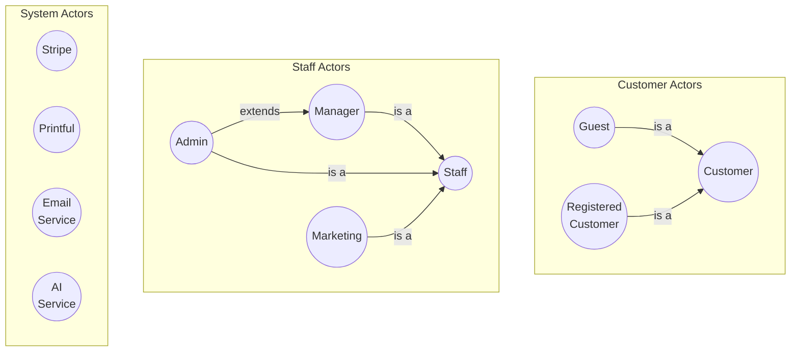

---

## 2. Use Case Catalog

### 2.1 Summary by Functional Area

| Area | Use Cases | Priority |
|------|-----------|----------|
| Catalog & Navigation | 5 | MVP |
| Shopping Cart | 4 | MVP |
| Checkout & Payment | 4 | MVP |
| Order Management | 5 | MVP |
| User Account | 6 | MVP |
| Product Management | 4 | MVP |
| Content Generation | 2 | MVP |
| Promo Codes | 2 | MVP |
| Communication | 3 | MVP |
| System Integration | 4 | MVP |
| **Total** | **39** | |

---

### 2.2 Catalog & Navigation

| ID | Use Case | Actor(s) | Priority | Description |
|----|----------|----------|----------|-------------|
| UC-CAT-01 | View Product Catalog | Customer | MVP | Browse paginated list of products |
| UC-CAT-02 | Search Products | Customer | MVP | Search products by keyword |
| UC-CAT-03 | Filter Products | Customer | MVP | Filter by type, price, etc. |
| UC-CAT-04 | Sort Products | Customer | MVP | Sort by price, popularity, date |
| UC-CAT-05 | View Product Detail | Customer | MVP | View full product information |

### 2.3 Shopping Cart

| ID | Use Case | Actor(s) | Priority | Description |
|----|----------|----------|----------|-------------|
| UC-CART-01 | Manage Cart | Customer | MVP | Add, update, remove items from cart |
| UC-CART-02 | View Cart | Customer | MVP | View cart contents and totals |
| UC-CART-03 | Apply Promo Code | Customer | MVP | Apply discount code to cart |
| UC-CART-04 | View Cross-Sell Recommendations | Customer | MVP | See related products in cart |

### 2.4 Checkout & Payment

| ID | Use Case | Actor(s) | Priority | Description |
|----|----------|----------|----------|-------------|
| UC-CHK-01 | Checkout as Guest | Guest | MVP | Complete purchase without account |
| UC-CHK-02 | Checkout as Registered | Registered Customer | MVP | Complete purchase with saved data |
| UC-CHK-03 | Process Payment | Customer, Stripe | MVP | Handle payment via Stripe |
| UC-CHK-04 | View Order Confirmation | Customer | MVP | See purchase confirmation |

### 2.5 Order Management

| ID | Use Case | Actor(s) | Priority | Description |
|----|----------|----------|----------|-------------|
| UC-ORD-01 | View Order Status | Customer | MVP | Check order current status |
| UC-ORD-02 | View Order History | Registered Customer | MVP | List past orders |
| UC-ORD-03 | View Order Detail | Customer | MVP | See full order information |
| UC-ORD-04 | Request Refund | Customer | MVP | Initiate return process |
| UC-ORD-05 | Track Shipment | Customer | MVP | View shipping tracking info |

### 2.6 User Account

| ID | Use Case | Actor(s) | Priority | Description |
|----|----------|----------|----------|-------------|
| UC-ACC-01 | Register Account | Guest | MVP | Create new user account |
| UC-ACC-02 | Log In | Guest | MVP | Authenticate to the system |
| UC-ACC-03 | Log Out | Registered Customer | MVP | End authenticated session |
| UC-ACC-04 | Recover Password | Guest | MVP | Reset forgotten password |
| UC-ACC-05 | Manage Profile | Registered Customer | MVP | Update personal information |
| UC-ACC-06 | Manage Addresses | Registered Customer | MVP | CRUD saved addresses |

### 2.7 Product Management (Back-office)

| ID | Use Case | Actor(s) | Priority | Description |
|----|----------|----------|----------|-------------|
| UC-PRD-01 | Manage Products | Manager, Admin | MVP | Create, edit, delete, activate products |
| UC-PRD-02 | Manage Product Images | Manager, Admin | MVP | Upload, reorder, delete images |
| UC-PRD-03 | Manage Product Reviews | Manager, Admin | MVP | Add, edit, hide reviews |
| UC-PRD-04 | View Product Analytics | Manager, Admin | MVP | See views, sales, conversion |

### 2.8 Content Generation

| ID | Use Case | Actor(s) | Priority | Description |
|----|----------|----------|----------|-------------|
| UC-GEN-01 | Generate Meme Image | Manager, Admin, AI Service | MVP | Create product image with AI |
| UC-GEN-02 | Generate Product Reviews | Manager, Admin, AI Service | MVP | Create AI-generated reviews |

### 2.9 Promo Codes

| ID | Use Case | Actor(s) | Priority | Description |
|----|----------|----------|----------|-------------|
| UC-PRM-01 | Manage Promo Codes | Marketing, Admin | MVP | Create, edit, deactivate codes |
| UC-PRM-02 | View Promo Code Usage | Marketing, Admin | MVP | See code performance metrics |

### 2.10 Communication

| ID | Use Case | Actor(s) | Priority | Description |
|----|----------|----------|----------|-------------|
| UC-COM-01 | Subscribe to Newsletter | Customer | MVP | Join email list |
| UC-COM-02 | Send Contact Message | Customer | MVP | Submit contact form |
| UC-COM-03 | Share Product on Social Media | Customer | MVP | Share product link |

### 2.11 User Management (Admin)

| ID | Use Case | Actor(s) | Priority | Description |
|----|----------|----------|----------|-------------|
| UC-USR-01 | Manage Staff Users | Admin | MVP | Create, edit, deactivate staff |

### 2.12 System Integration

| ID | Use Case | Actor(s) | Priority | Description |
|----|----------|----------|----------|-------------|
| UC-INT-01 | Process Stripe Webhook | Stripe, System | MVP | Handle payment events |
| UC-INT-02 | Sync Order with Printful | System, Printful | MVP | Send order for fulfillment |
| UC-INT-03 | Process Printful Webhook | Printful, System | MVP | Handle fulfillment events |
| UC-INT-04 | Send Transactional Email | System, Email Service | MVP | Deliver order/account emails |

---

## 3. Use Case Diagrams

### 3.1 Catalog & Shopping

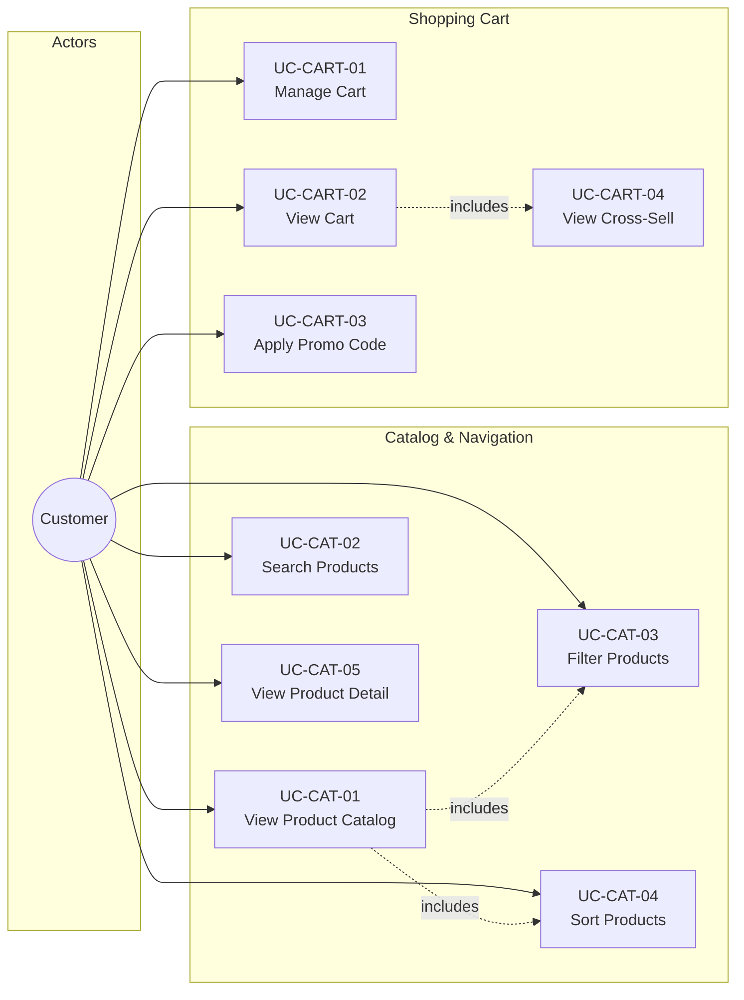

### 3.2 Checkout & Payment

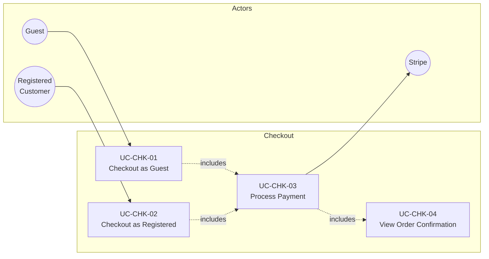

### 3.3 Order Management

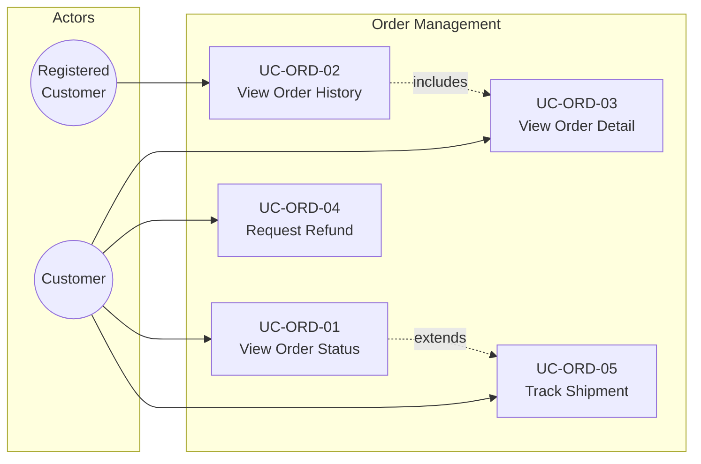

### 3.4 User Account

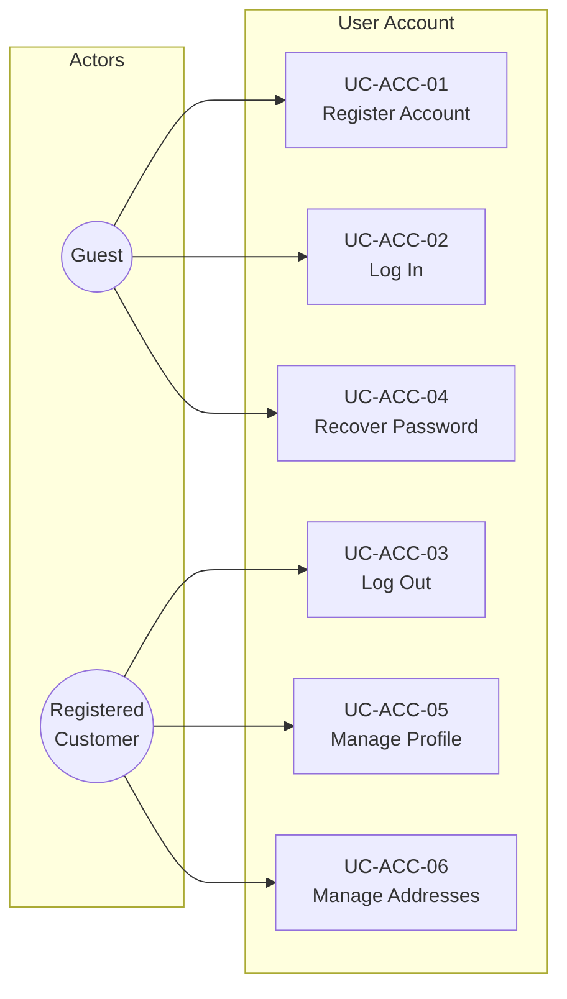

### 3.5 Back-Office: Product Management

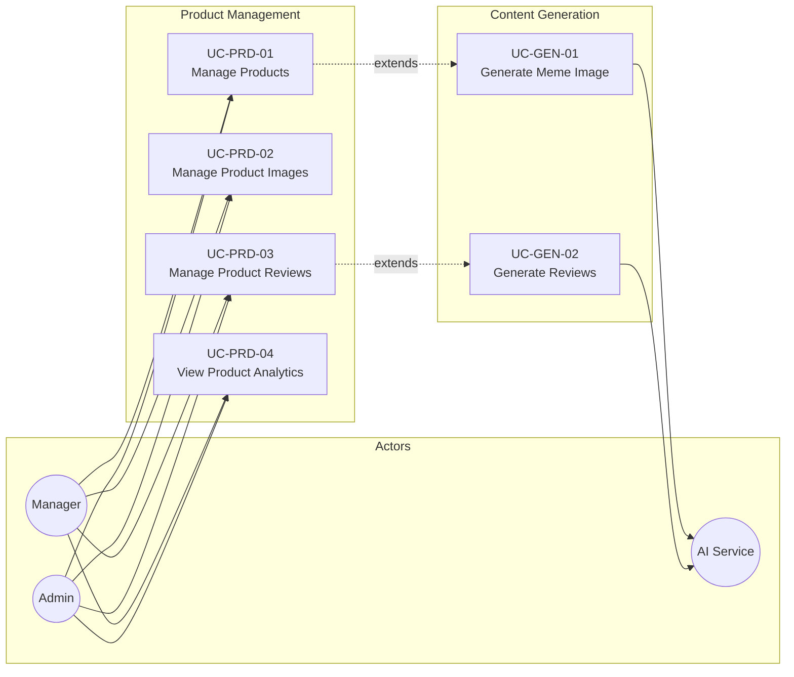

### 3.6 Back-Office: Marketing & Admin

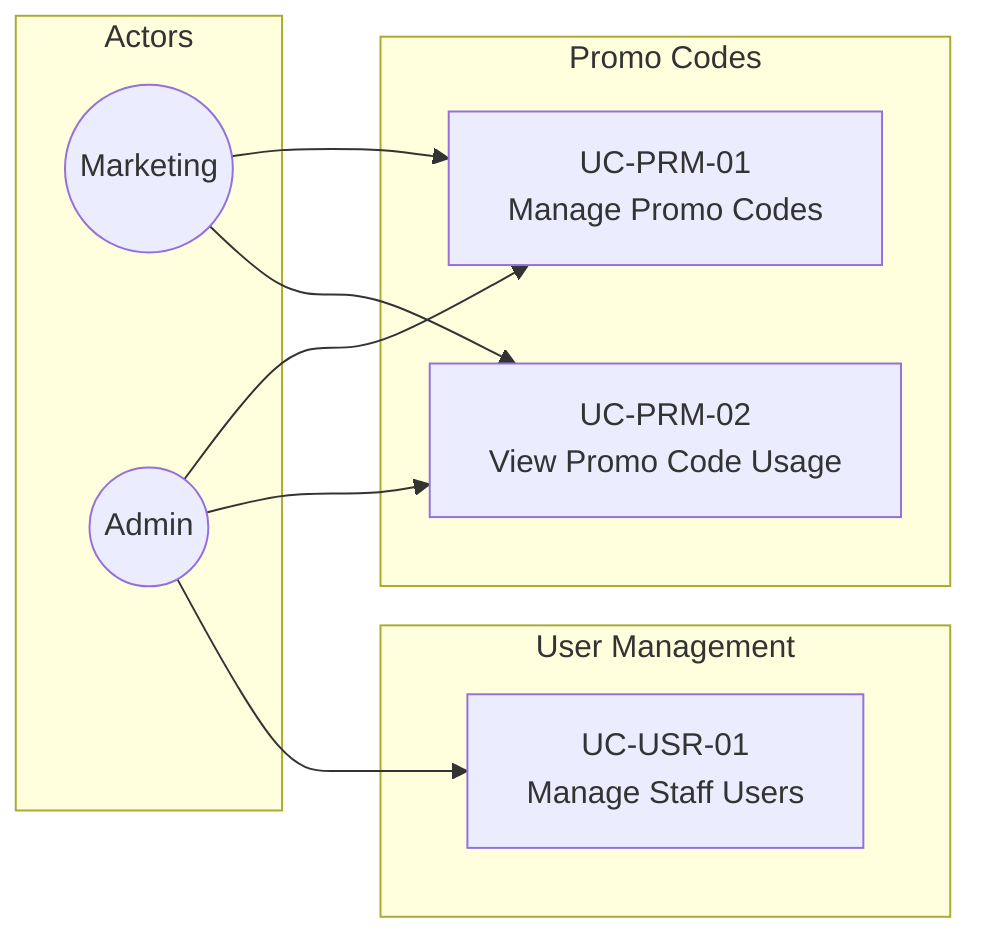

### 3.7 System Integration

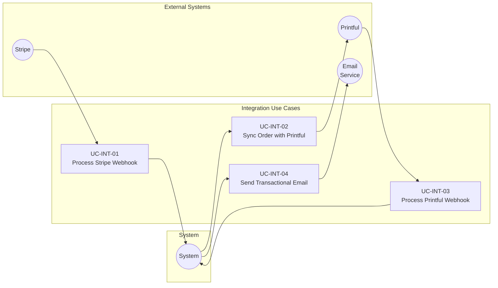

---

## 4. Detailed Use Case Specifications

### 4.1 UC-CAT-05: View Product Detail

| Field | Value |
|-------|-------|
| **ID** | UC-CAT-05 |
| **Name** | View Product Detail |
| **Actor(s)** | Customer |
| **Priority** | MVP |
| **Description** | Customer views complete information about a specific product including images, description, price, reviews, and related products. |

**Preconditions:**
- Product exists in the system
- Product is active (not deleted or deactivated)

**Postconditions:**
- Product view count is incremented
- Page view event is tracked in analytics

**Main Flow:**

| Step | Actor | System |
|------|-------|--------|
| 1 | Customer clicks on a product from catalog or follows direct link | |
| 2 | | System retrieves product data including images, reviews, and related products |
| 3 | | System increments view counter |
| 4 | | System tracks `view_item` analytics event |
| 5 | | System displays product detail page with: title, images, description, price, size selector (if applicable), reviews, "Add to Cart" button, related products |
| 6 | Customer views product information | |

**Alternative Flows:**

| ID | Condition | Steps |
|----|-----------|-------|
| AF-1 | Product has multiple images | System displays image gallery with navigation |
| AF-2 | Product has sizes | System displays size selector with available options |
| AF-3 | Product has compare_at_price | System displays original price crossed out with current price |

**Exception Flows:**

| ID | Condition | Steps |
|----|-----------|-------|
| EF-1 | Product not found | System displays 404 page with link to catalog |
| EF-2 | Product is inactive | System displays "Product unavailable" message |

**Business Rules:**
- BR-1: Only active products are viewable
- BR-2: Reviews marked as `is_visible: false` are not shown
- BR-3: Related products must be from the same product type or marked as "hot"

**Related Use Cases:**
- UC-CART-01: Manage Cart (customer can add product to cart)
- UC-COM-03: Share Product on Social Media

---

### 4.2 UC-CART-01: Manage Cart

| Field | Value |
|-------|-------|
| **ID** | UC-CART-01 |
| **Name** | Manage Cart |
| **Actor(s)** | Customer |
| **Priority** | MVP |
| **Description** | Customer manages shopping cart: add items, update quantities, remove items. Cart persists across browser sessions. |

**Preconditions:**
- None (cart is created on first interaction)

**Postconditions:**
- Cart reflects customer's selections
- Cart is persisted (localStorage for guests, database for registered users)

**Main Flow - Add to Cart:**

| Step | Actor | System |
|------|-------|--------|
| 1 | Customer selects size (if applicable) on product page | |
| 2 | Customer clicks "Add to Cart" | |
| 3 | | System validates product is available |
| 4 | | System adds item to cart (or increments quantity if already exists) |
| 5 | | System tracks `add_to_cart` analytics event |
| 6 | | System displays cart confirmation (mini-cart or notification) |

**Main Flow - Update Quantity:**

| Step | Actor | System |
|------|-------|--------|
| 1 | Customer navigates to cart page | |
| 2 | Customer changes quantity of an item | |
| 3 | | System validates new quantity (min: 1, max: stock limit) |
| 4 | | System updates cart totals |
| 5 | | System displays updated cart |

**Main Flow - Remove Item:**

| Step | Actor | System |
|------|-------|--------|
| 1 | Customer clicks remove button on cart item | |
| 2 | | System removes item from cart |
| 3 | | System tracks `remove_from_cart` analytics event |
| 4 | | System displays updated cart |

**Alternative Flows:**

| ID | Condition | Steps |
|----|-----------|-------|
| AF-1 | Customer is registered and logged in | Cart is synchronized with database |
| AF-2 | Cart has promo code applied | System recalculates discount after changes |

**Exception Flows:**

| ID | Condition | Steps |
|----|-----------|-------|
| EF-1 | Product became unavailable | System notifies customer and removes item |
| EF-2 | Price changed since added | System updates price and notifies customer |

**Business Rules:**
- BR-1: Cart persists for 30 days in localStorage
- BR-2: When registered user logs in, localStorage cart merges with database cart
- BR-3: Size is required for products with `has_sizes: true`

---

### 4.3 UC-CHK-01: Checkout as Guest

| Field | Value |
|-------|-------|
| **ID** | UC-CHK-01 |
| **Name** | Checkout as Guest |
| **Actor(s)** | Guest, Stripe |
| **Priority** | MVP |
| **Description** | Guest customer completes purchase without creating an account. |

**Preconditions:**
- Cart contains at least one item
- All cart items are available

**Postconditions:**
- Order is created with status PENDING
- Payment is processed
- Order status changes to PAID
- Order is sent to Printful
- Confirmation email is sent

**Main Flow:**

| Step | Actor | System |
|------|-------|--------|
| 1 | Guest clicks "Checkout" from cart | |
| 2 | | System displays checkout page with guest/login options |
| 3 | Guest selects "Continue as Guest" | |
| 4 | | System displays shipping form |
| 5 | Guest enters email, phone, and shipping address | |
| 6 | | System validates input data |
| 7 | | System calculates shipping cost via Printful API |
| 8 | | System displays order summary with totals |
| 9 | Guest confirms order | |
| 10 | | System tracks `begin_checkout` analytics event |
| 11 | | System creates Stripe Checkout Session |
| 12 | | System redirects to Stripe Checkout |
| 13 | Guest enters payment information on Stripe | |
| 14 | | Stripe processes payment |
| 15 | | Stripe redirects to success URL with session ID |
| 16 | | System creates order with status PAID |
| 17 | | System tracks `purchase` analytics event |
| 18 | | System sends order to Printful (UC-INT-02) |
| 19 | | System sends confirmation email (UC-INT-04) |
| 20 | | System displays order confirmation page |

**Alternative Flows:**

| ID | Condition | Steps |
|----|-----------|-------|
| AF-1 | Guest has promo code | System applies discount before payment |
| AF-2 | Guest wants to create account | System offers registration after purchase |

**Exception Flows:**

| ID | Condition | Steps |
|----|-----------|-------|
| EF-1 | Payment fails | Stripe displays error; guest can retry |
| EF-2 | Guest abandons checkout | Cart is preserved; abandonment tracked |
| EF-3 | Product unavailable during checkout | System notifies and removes item |

**Business Rules:**
- BR-1: Email is required for guest checkout (for order communications)
- BR-2: Phone is required for shipping purposes
- BR-3: Order number format: `ORD-YYYYMMDD-XXXXX`

**Related Use Cases:**
- UC-CART-03: Apply Promo Code (included)
- UC-CHK-03: Process Payment (included)
- UC-CHK-04: View Order Confirmation (included)
- UC-INT-02: Sync Order with Printful (triggered)
- UC-INT-04: Send Transactional Email (triggered)

---

### 4.4 UC-CHK-02: Checkout as Registered

| Field | Value |
|-------|-------|
| **ID** | UC-CHK-02 |
| **Name** | Checkout as Registered |
| **Actor(s)** | Registered Customer, Stripe |
| **Priority** | MVP |
| **Description** | Registered customer completes purchase using saved information. |

**Preconditions:**
- Customer is authenticated
- Cart contains at least one item

**Postconditions:**
- Same as UC-CHK-01
- Order is linked to user account

**Main Flow:**

| Step | Actor | System |
|------|-------|--------|
| 1 | Customer clicks "Checkout" from cart | |
| 2 | | System detects authenticated session |
| 3 | | System displays checkout with saved addresses |
| 4 | Customer selects shipping address (or adds new) | |
| 5 | | System calculates shipping cost |
| 6 | | System displays order summary |
| 7 | Customer confirms order | |
| 8 | | System creates Stripe Checkout Session with customer ID |
| 9 | | (Steps 12-20 same as UC-CHK-01) |

**Alternative Flows:**

| ID | Condition | Steps |
|----|-----------|-------|
| AF-1 | Customer has no saved addresses | System displays address form |
| AF-2 | Customer wants to save new address | System saves address to profile |

**Business Rules:**
- BR-1: If customer has Stripe Customer ID, it's used for payment
- BR-2: Customer can save new address during checkout

---

### 4.5 UC-ORD-02: View Order History

| Field | Value |
|-------|-------|
| **ID** | UC-ORD-02 |
| **Name** | View Order History |
| **Actor(s)** | Registered Customer |
| **Priority** | MVP |
| **Description** | Registered customer views list of all past orders. |

**Preconditions:**
- Customer is authenticated

**Postconditions:**
- Order history is displayed

**Main Flow:**

| Step | Actor | System |
|------|-------|--------|
| 1 | Customer navigates to "My Orders" in account section | |
| 2 | | System retrieves orders for authenticated user |
| 3 | | System displays paginated list with: order number, date, status, total, item thumbnails |
| 4 | Customer can click on order to view details (UC-ORD-03) | |

**Business Rules:**
- BR-1: Orders are sorted by date descending (newest first)
- BR-2: Soft-deleted orders are not shown

---

### 4.6 UC-ORD-01: View Order Status

| Field | Value |
|-------|-------|
| **ID** | UC-ORD-01 |
| **Name** | View Order Status |
| **Actor(s)** | Customer (Guest or Registered) |
| **Priority** | MVP |
| **Description** | Customer checks the current status of an order. |

**Preconditions:**
- Order exists
- Customer has order number and verification data (email or phone)

**Postconditions:**
- Order status is displayed

**Main Flow (Guest):**

| Step | Actor | System |
|------|-------|--------|
| 1 | Guest navigates to "Track Order" page | |
| 2 | | System displays verification form |
| 3 | Guest enters order number and email (or phone) | |
| 4 | | System validates credentials match order |
| 5 | | System displays order status and details |

**Main Flow (Registered):**

| Step | Actor | System |
|------|-------|--------|
| 1 | Customer selects order from history | |
| 2 | | System displays order status and details |

**Exception Flows:**

| ID | Condition | Steps |
|----|-----------|-------|
| EF-1 | Credentials don't match | System displays error message |
| EF-2 | Order not found | System displays "Order not found" message |

---

### 4.7 UC-PRD-01: Manage Products

| Field | Value |
|-------|-------|
| **ID** | UC-PRD-01 |
| **Name** | Manage Products |
| **Actor(s)** | Manager, Admin |
| **Priority** | MVP |
| **Description** | Staff creates, edits, deletes, and manages product visibility. |

**Preconditions:**
- User is authenticated with Manager or Admin role

**Postconditions:**
- Product changes are persisted
- Price history is recorded for price changes

**Sub-flow: Create Product:**

| Step | Actor | System |
|------|-------|--------|
| 1 | Staff navigates to product management | |
| 2 | Staff clicks "Create Product" | |
| 3 | | System displays product form |
| 4 | Staff enters: product type, title (ES/EN), description (ES/EN), price, sizes, color | |
| 5 | Staff optionally generates image with AI (UC-GEN-01) | |
| 6 | Staff uploads or selects product images | |
| 7 | Staff optionally generates reviews with AI (UC-GEN-02) | |
| 8 | Staff clicks "Save" | |
| 9 | | System validates required fields |
| 10 | | System generates slug from title |
| 11 | | System creates product record |
| 12 | | System records initial price in history |
| 13 | | System displays success message |

**Sub-flow: Edit Product:**

| Step | Actor | System |
|------|-------|--------|
| 1 | Staff selects product from list | |
| 2 | | System displays product form with current data |
| 3 | Staff modifies fields | |
| 4 | Staff clicks "Save" | |
| 5 | | System validates changes |
| 6 | | System updates product |
| 7 | | If price changed, system records in price history |

**Sub-flow: Delete Product:**

| Step | Actor | System |
|------|-------|--------|
| 1 | Staff clicks "Delete" on product | |
| 2 | | System displays confirmation dialog |
| 3 | Staff confirms deletion | |
| 4 | | System soft-deletes product (sets deleted_at) |

**Sub-flow: Toggle Product Visibility:**

| Step | Actor | System |
|------|-------|--------|
| 1 | Staff clicks activate/deactivate toggle | |
| 2 | | System updates is_active flag |
| 3 | | Deactivated products hidden from catalog |

**Business Rules:**
- BR-1: Slug must be unique; system appends number if conflict
- BR-2: Price changes require reason (optional but recommended)
- BR-3: Deleted products are soft-deleted, not removed from DB
- BR-4: Products with orders cannot be hard-deleted

---

### 4.8 UC-GEN-01: Generate Meme Image

| Field | Value |
|-------|-------|
| **ID** | UC-GEN-01 |
| **Name** | Generate Meme Image |
| **Actor(s)** | Manager, Admin, AI Service |
| **Priority** | MVP |
| **Description** | Staff generates product meme image using AI based on text, image, or both. |

**Preconditions:**
- User is in product creation/edit flow
- AI Service is available

**Postconditions:**
- Generated image is available for selection
- Image can be used as product image

**Main Flow:**

| Step | Actor | System |
|------|-------|--------|
| 1 | Staff clicks "Generate Image with AI" | |
| 2 | | System displays generation options |
| 3 | Staff selects input method: text only, image only, or both | |
| 4 | Staff provides text prompt and/or uploads reference image | |
| 5 | Staff selects number of variations (1-4) | |
| 6 | Staff clicks "Generate" | |
| 7 | | System sends request to AI Service |
| 8 | | System displays loading indicator |
| 9 | | AI Service returns generated images |
| 10 | | System displays image options |
| 11 | Staff selects preferred image | |
| 12 | | System adds image to product |

**Alternative Flows:**

| ID | Condition | Steps |
|----|-----------|-------|
| AF-1 | Staff wants more variations | Staff can regenerate with same or modified prompt |
| AF-2 | No suitable image generated | Staff can upload manual image instead |

**Exception Flows:**

| ID | Condition | Steps |
|----|-----------|-------|
| EF-1 | AI Service unavailable | System displays error; staff must upload manually |
| EF-2 | Content policy violation | System displays warning; prompt must be modified |

---

### 4.9 UC-GEN-02: Generate Product Reviews

| Field | Value |
|-------|-------|
| **ID** | UC-GEN-02 |
| **Name** | Generate Product Reviews |
| **Actor(s)** | Manager, Admin, AI Service |
| **Priority** | MVP |
| **Description** | Staff generates AI-written positive reviews for product. |

**Preconditions:**
- User is in product creation/edit flow
- AI Service is available

**Postconditions:**
- Generated reviews are added to product
- Reviews are marked as AI-generated

**Main Flow:**

| Step | Actor | System |
|------|-------|--------|
| 1 | Staff clicks "Generate Reviews with AI" | |
| 2 | | System displays generation options |
| 3 | Staff selects number of reviews (1-5) | |
| 4 | Staff clicks "Generate" | |
| 5 | | System sends request to AI Service with product context |
| 6 | | AI Service generates reviews (positive, 50-100 words each) |
| 7 | | System displays generated reviews for approval |
| 8 | Staff reviews and optionally edits each review | |
| 9 | Staff selects which reviews to keep | |
| 10 | Staff clicks "Add Reviews" | |
| 11 | | System creates review records with is_ai_generated: true |

**Business Rules:**
- BR-1: Generated reviews must be positive
- BR-2: Reviews focus on: product quality, service quality, shipping speed
- BR-3: Reviews are between 50-100 words
- BR-4: AI-generated flag is stored for transparency

---

### 4.10 UC-PRM-01: Manage Promo Codes

| Field | Value |
|-------|-------|
| **ID** | UC-PRM-01 |
| **Name** | Manage Promo Codes |
| **Actor(s)** | Marketing, Admin |
| **Priority** | MVP |
| **Description** | Staff creates, edits, and manages promotional discount codes. |

**Preconditions:**
- User is authenticated with Marketing or Admin role

**Postconditions:**
- Promo code changes are persisted

**Sub-flow: Create Promo Code:**

| Step | Actor | System |
|------|-------|--------|
| 1 | Staff navigates to promo code management | |
| 2 | Staff clicks "Create Promo Code" | |
| 3 | | System displays form |
| 4 | Staff enters: code, discount type (% or fixed), value, validity dates, usage limits | |
| 5 | Staff clicks "Save" | |
| 6 | | System validates code uniqueness |
| 7 | | System creates promo code |

**Business Rules:**
- BR-1: Code is stored uppercase
- BR-2: Percentage discount cannot exceed 100%
- BR-3: max_discount_amount caps percentage discounts

---

### 4.11 UC-INT-01: Process Stripe Webhook

| Field | Value |
|-------|-------|
| **ID** | UC-INT-01 |
| **Name** | Process Stripe Webhook |
| **Actor(s)** | Stripe, System |
| **Priority** | MVP |
| **Description** | System receives and processes payment events from Stripe. |

**Preconditions:**
- Stripe webhook is configured
- Webhook signature is valid

**Postconditions:**
- Order status is updated based on event
- Related processes are triggered

**Main Flow:**

| Step | Actor | System |
|------|-------|--------|
| 1 | | Stripe sends webhook event |
| 2 | | System validates webhook signature |
| 3 | | System parses event type |
| 4 | | System processes event based on type (see table below) |
| 5 | | System returns 200 OK to Stripe |

**Event Handling:**

| Event | Action |
|-------|--------|
| `checkout.session.completed` | Update order to PAID, trigger Printful sync |
| `payment_intent.payment_failed` | Log failure, notify customer |
| `charge.refunded` | Update order to REFUNDED, track refund event |

**Exception Flows:**

| ID | Condition | Steps |
|----|-----------|-------|
| EF-1 | Invalid signature | Return 401; do not process |
| EF-2 | Order not found | Log error; return 200 (idempotency) |

---

### 4.12 UC-INT-02: Sync Order with Printful

| Field | Value |
|-------|-------|
| **ID** | UC-INT-02 |
| **Name** | Sync Order with Printful |
| **Actor(s)** | System, Printful |
| **Priority** | MVP |
| **Description** | System sends paid order to Printful for production and fulfillment. |

**Preconditions:**
- Order status is PAID
- Order has valid shipping address
- Products have Printful sync IDs

**Postconditions:**
- Order is created in Printful
- Order status changes to PROCESSING
- Printful order ID is stored

**Main Flow:**

| Step | Actor | System |
|------|-------|--------|
| 1 | | System prepares order data for Printful API |
| 2 | | System maps products to Printful variants |
| 3 | | System sends create order request to Printful |
| 4 | | Printful validates and creates order |
| 5 | | System receives Printful order ID |
| 6 | | System updates order: printful_order_id, status = PROCESSING |

**Exception Flows:**

| ID | Condition | Steps |
|----|-----------|-------|
| EF-1 | Printful API error | Log error; queue for retry; notify manager |
| EF-2 | Product not synced | Log error; notify manager for manual handling |

---

### 4.13 UC-INT-03: Process Printful Webhook

| Field | Value |
|-------|-------|
| **ID** | UC-INT-03 |
| **Name** | Process Printful Webhook |
| **Actor(s)** | Printful, System |
| **Priority** | MVP |
| **Description** | System receives and processes fulfillment events from Printful. |

**Preconditions:**
- Printful webhook is configured

**Postconditions:**
- Order status is updated
- Tracking information is stored
- Customer is notified

**Event Handling:**

| Event | Action |
|-------|--------|
| `package_shipped` | Update status to SHIPPED, store tracking info, email customer |
| `package_returned` | Log return, notify manager |

---

### 4.14 UC-INT-04: Send Transactional Email

| Field | Value |
|-------|-------|
| **ID** | UC-INT-04 |
| **Name** | Send Transactional Email |
| **Actor(s)** | System, Email Service |
| **Priority** | MVP |
| **Description** | System sends automated emails for various events. |

**Email Types:**

| Type | Trigger | Content |
|------|---------|---------|
| Order Confirmation | Order PAID | Order details, estimated delivery |
| Shipping Notification | Order SHIPPED | Tracking number, tracking link |
| Delivery Confirmation | Order DELIVERED | Feedback request, discount code |
| Password Reset | Password recovery request | Reset link (expires in 1h) |
| Welcome | Account registration | Welcome message, next steps |

---

## 5. Flow Diagrams

### 5.1 Checkout Process Flow

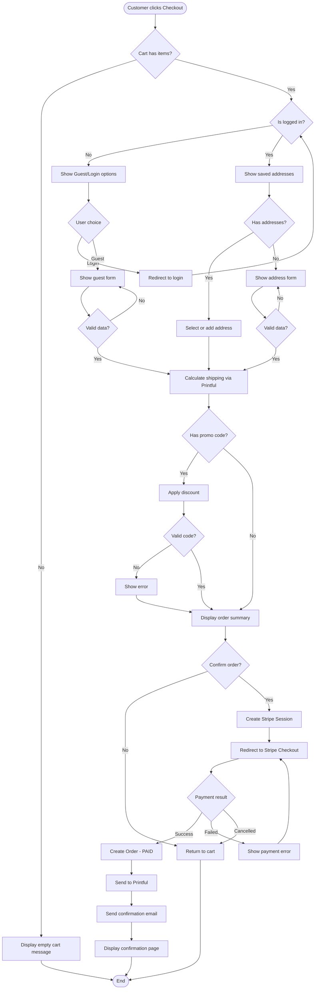

### 5.2 Product Creation Flow

```mermaid
flowchart TD
    Start([Manager clicks Create Product]) --> ShowForm[Display product form]

    ShowForm --> EnterBasic[Enter basic info:<br/>type, title, description, price]
    EnterBasic --> NeedsSizes{Product type has sizes?}

    NeedsSizes -->|Yes| SelectSizes[Select available sizes]
    NeedsSizes -->|No| ImageSection
    SelectSizes --> ImageSection

    ImageSection[Image section] --> ImageChoice{Image source?}

    ImageChoice -->|Upload| UploadImage[Upload image file]
    ImageChoice -->|Generate AI| AIImageFlow

    subgraph AIImageFlow[AI Image Generation]
        SelectInput[Select input: text/image/both]
        SelectInput --> ProvideInput[Provide prompt/image]
        ProvideInput --> GenerateImages[Call AI Service]
        GenerateImages --> ShowOptions[Display variations]
        ShowOptions --> SelectImage[Select preferred image]
    end

    UploadImage --> AddMoreImages{Add more images?}
    SelectImage --> AddMoreImages

    AddMoreImages -->|Yes| ImageSection
    AddMoreImages -->|No| ReviewSection

    ReviewSection[Review section] --> ReviewChoice{Add reviews?}

    ReviewChoice -->|No| ValidateProduct
    ReviewChoice -->|Manual| ManualReview[Enter review manually]
    ReviewChoice -->|Generate AI| AIReviewFlow

    subgraph AIReviewFlow[AI Review Generation]
        SelectCount[Select number of reviews]
        SelectCount --> GenerateReviews[Call AI Service]
        GenerateReviews --> DisplayReviews[Display generated reviews]
        DisplayReviews --> EditReviews[Edit if needed]
        EditReviews --> ConfirmReviews[Select reviews to keep]
    end

    ManualReview --> MoreReviews{Add more reviews?}
    ConfirmReviews --> MoreReviews

    MoreReviews -->|Yes| ReviewSection
    MoreReviews -->|No| ValidateProduct

    ValidateProduct{All required fields?} -->|No| ShowErrors[Highlight missing fields]
    ShowErrors --> ShowForm

    ValidateProduct -->|Yes| SaveProduct[Save product to database]
    SaveProduct --> RecordPrice[Record initial price in history]
    RecordPrice --> SyncPrintful{Sync with Printful?}

    SyncPrintful -->|Yes| CreatePrintfulProduct[Create in Printful]
    SyncPrintful -->|No| ShowSuccess
    CreatePrintfulProduct --> StorePrintfulId[Store Printful IDs]
    StorePrintfulId --> ShowSuccess

    ShowSuccess[Display success message] --> End([End])
```

### 5.3 Order Lifecycle Flow

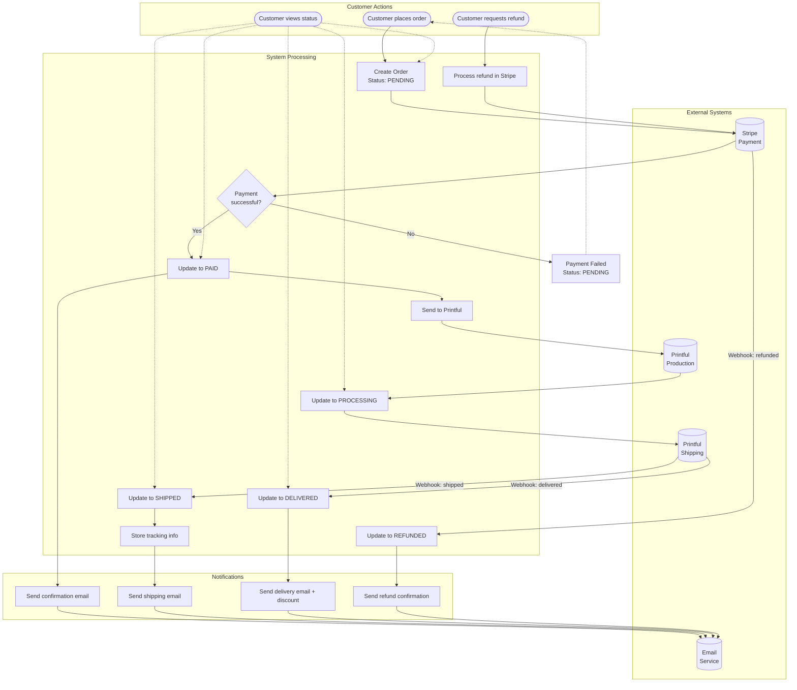

### 5.4 Refund/Return Process Flow

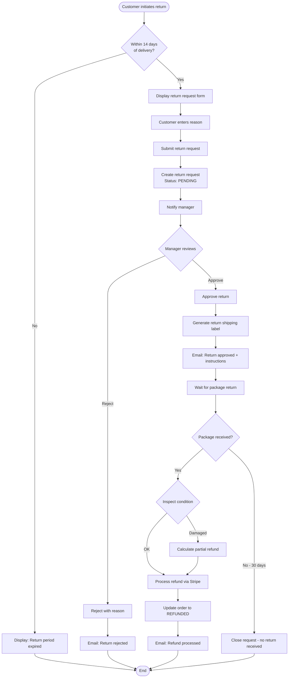

---

## 6. Use Case Traceability Matrix

### Requirements to Use Cases

| Requirement ID | Requirement | Use Case(s) |
|----------------|-------------|-------------|
| RF-T01 | View product listing | UC-CAT-01, UC-CAT-03, UC-CAT-04 |
| RF-T05 | View product detail | UC-CAT-05 |
| RF-T07 | Add to cart | UC-CART-01 |
| RF-T11 | Apply promo code | UC-CART-03 |
| RF-T12 | Purchase as guest | UC-CHK-01 |
| RF-T16 | Complete checkout | UC-CHK-01, UC-CHK-02 |
| RF-T19 | Check order status | UC-ORD-01 |
| RF-T20 | View order history | UC-ORD-02 |
| RF-G04 | Create product | UC-PRD-01 |
| RF-G08 | Generate AI images | UC-GEN-01 |
| RF-G09 | Generate AI reviews | UC-GEN-02 |
| RF-M03 | Create promo codes | UC-PRM-01 |
| RF-S01 | Stripe integration | UC-CHK-03, UC-INT-01 |
| RF-S02 | Printful integration | UC-INT-02, UC-INT-03 |

---

*Document version: 1.0*
*Last updated: January 2026*
