# System Architecture Documentation

## 1. Overview

This document describes the system architecture for the **Meme Products E-commerce Platform**, a print-on-demand e-commerce solution that sells products featuring trending memes.

### 1.1 Business Context

The platform enables:
- **Customers** to browse and purchase meme-branded products
- **Managers** to create and manage products with AI-generated content
- **Admins** to oversee the entire system
- **Marketing** to manage promotional campaigns

### 1.2 Key Architectural Decisions

| Decision | Choice | Rationale |
|----------|--------|-----------|
| Architecture Style | Monolithic with modular structure | Simpler deployment for MVP, easy to split later |
| API Design | REST with OpenAPI spec | Industry standard, excellent tooling |
| Database | PostgreSQL with Prisma ORM | Type-safety, excellent migrations, robust JSONB support |
| Authentication | JWT with refresh tokens | Stateless, scalable, secure |
| Frontend | Next.js (SSR/SSG) | SEO requirements, excellent DX |
| Payments | Stripe | PCI compliance, reliable, well-documented |
| Production | Printful (print-on-demand) | No inventory, scalable, API-driven |

---

## 2. High-Level Architecture Diagram

```mermaid
flowchart TB
    subgraph Clients["👥 Clients"]
        WebStore["🛒 Web Store<br/>(Next.js - SSR)"]
        AdminPanel["⚙️ Admin Panel<br/>(Next.js - SPA)"]
    end

    subgraph LoadBalancer["🔄 Load Balancer"]
        Nginx["Nginx / Cloud LB"]
    end

    subgraph Backend["🖥️ Backend Services"]
        API["REST API<br/>(Express + TypeScript)"]

        subgraph Modules["📦 API Modules"]
            AuthModule["Auth Module"]
            ProductModule["Product Module"]
            OrderModule["Order Module"]
            UserModule["User Module"]
            PromoModule["Promo Module"]
            AIModule["AI Module"]
        end
    end

    subgraph DataLayer["💾 Data Layer"]
        PostgreSQL[("PostgreSQL<br/>Primary Database")]
        Redis[("Redis<br/>Cache & Sessions")]
        CDN["CDN<br/>(Images)"]
    end

    subgraph ExternalServices["🌐 External Services"]
        Stripe["💳 Stripe<br/>Payments"]
        Printful["🖨️ Printful<br/>Print-on-Demand"]
        OpenAI["🤖 OpenAI<br/>AI Generation"]
        EmailService["📧 Email Service<br/>(SendGrid/Resend)"]
        Analytics["📊 Google Analytics 4"]
    end

    subgraph Monitoring["📈 Monitoring"]
        Sentry["Sentry<br/>Error Tracking"]
        Logging["Pino Logger"]
    end

    %% Client connections
    WebStore --> Nginx
    AdminPanel --> Nginx

    %% Load balancer to API
    Nginx --> API

    %% API to modules
    API --> AuthModule
    API --> ProductModule
    API --> OrderModule
    API --> UserModule
    API --> PromoModule
    API --> AIModule

    %% Modules to Data Layer
    AuthModule --> PostgreSQL
    AuthModule --> Redis
    ProductModule --> PostgreSQL
    ProductModule --> CDN
    OrderModule --> PostgreSQL
    UserModule --> PostgreSQL
    PromoModule --> PostgreSQL
    AIModule --> OpenAI

    %% External Service connections
    OrderModule --> Stripe
    OrderModule --> Printful
    OrderModule --> EmailService
    AuthModule --> EmailService

    %% Monitoring
    API --> Sentry
    API --> Logging

    %% Analytics
    WebStore --> Analytics
```

---

## 3. Component Architecture

### 3.1 Frontend Architecture

```mermaid
flowchart TB
    subgraph NextJS["Next.js Application"]
        subgraph Pages["📄 Pages (App Router)"]
            PublicPages["Public Pages<br/>- Home<br/>- Catalog<br/>- Product Detail<br/>- Cart<br/>- Checkout"]
            AuthPages["Auth Pages<br/>- Login<br/>- Register<br/>- Forgot Password"]
            AccountPages["Account Pages<br/>- Profile<br/>- Orders<br/>- Addresses"]
            AdminPages["Admin Pages<br/>- Dashboard<br/>- Products<br/>- Orders<br/>- Users<br/>- Promos"]
        end

        subgraph Components["🧩 Components"]
            UIComponents["UI Components<br/>(Shadcn/Radix)"]
            FeatureComponents["Feature Components<br/>- ProductCard<br/>- CartDrawer<br/>- CheckoutForm"]
            LayoutComponents["Layout Components<br/>- Header<br/>- Footer<br/>- Sidebar"]
        end

        subgraph State["📊 State Management"]
            ZustandStore["Zustand Stores<br/>- cartStore<br/>- authStore<br/>- uiStore"]
            ReactQuery["TanStack Query<br/>Server State"]
        end

        subgraph Services["🔌 Services"]
            APIClient["API Client<br/>(Axios)"]
            AuthService["Auth Service"]
            AnalyticsService["Analytics Service"]
        end
    end

    Pages --> Components
    Components --> State
    State --> Services
    Services --> |"HTTP"| BackendAPI["Backend API"]
```

### 3.2 Backend Architecture

```mermaid
flowchart TB
    subgraph Express["Express Application"]
        subgraph Middleware["🔒 Middleware Layer"]
            CORS["CORS"]
            RateLimiter["Rate Limiter"]
            AuthMiddleware["JWT Auth"]
            ValidationMiddleware["Zod Validation"]
            ErrorHandler["Error Handler"]
            RequestLogger["Pino Logger"]
        end

        subgraph Routes["🛣️ Routes"]
            AuthRoutes["/api/v1/auth"]
            UserRoutes["/api/v1/users"]
            ProductRoutes["/api/v1/products"]
            OrderRoutes["/api/v1/orders"]
            PromoRoutes["/api/v1/promo-codes"]
            AdminRoutes["/api/v1/admin"]
        end

        subgraph Controllers["🎮 Controllers"]
            AuthController["AuthController"]
            UserController["UserController"]
            ProductController["ProductController"]
            OrderController["OrderController"]
            PromoController["PromoController"]
        end

        subgraph Services["⚙️ Services"]
            AuthService["AuthService"]
            UserService["UserService"]
            ProductService["ProductService"]
            OrderService["OrderService"]
            PaymentService["PaymentService"]
            PrintfulService["PrintfulService"]
            EmailService["EmailService"]
            AIService["AIService"]
        end

        subgraph DataAccess["💾 Data Access"]
            PrismaClient["Prisma Client"]
            Repositories["Repositories"]
        end
    end

    Middleware --> Routes
    Routes --> Controllers
    Controllers --> Services
    Services --> DataAccess
    DataAccess --> Database[("PostgreSQL")]
```

---

## 4. Data Flow Diagrams

### 4.1 Purchase Flow

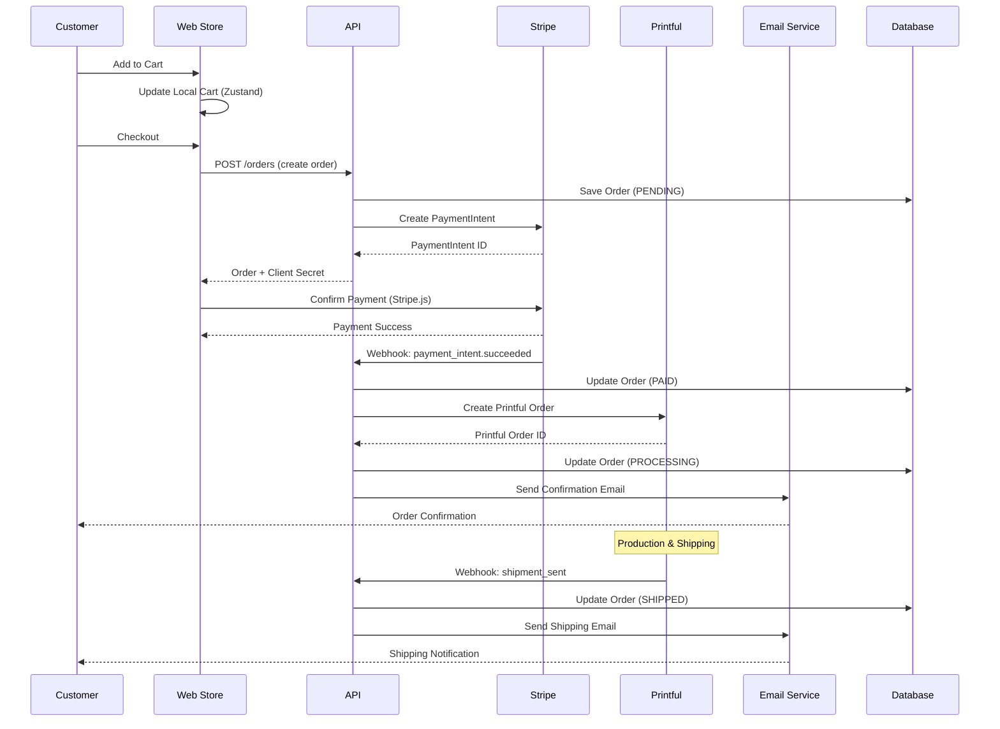

### 4.2 Product Creation Flow (Manager)

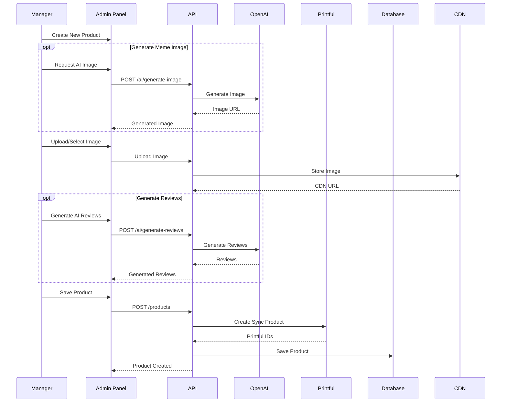

---

## 5. Security Architecture

```mermaid
flowchart TB
    subgraph Security["🔐 Security Layers"]
        subgraph Network["Network Security"]
            HTTPS["HTTPS/TLS"]
            Firewall["WAF"]
            DDoS["DDoS Protection"]
        end

        subgraph Auth["Authentication"]
            JWT["JWT Tokens"]
            RefreshToken["Refresh Tokens"]
            PasswordHash["Bcrypt Hashing"]
        end

        subgraph Authorization["Authorization"]
            RBAC["Role-Based Access<br/>TARGET | MANAGER | ADMIN | MARKETING"]
            Guards["Route Guards"]
        end

        subgraph Validation["Input Validation"]
            ZodSchemas["Zod Schemas"]
            Sanitization["Input Sanitization"]
            RateLimit["Rate Limiting"]
        end

        subgraph DataProtection["Data Protection"]
            Encryption["Encryption at Rest"]
            PCI["PCI Compliance<br/>(via Stripe)"]
            GDPR["GDPR Compliance"]
        end
    end

    Network --> Auth --> Authorization --> Validation --> DataProtection
```

### 5.1 Authentication Flow

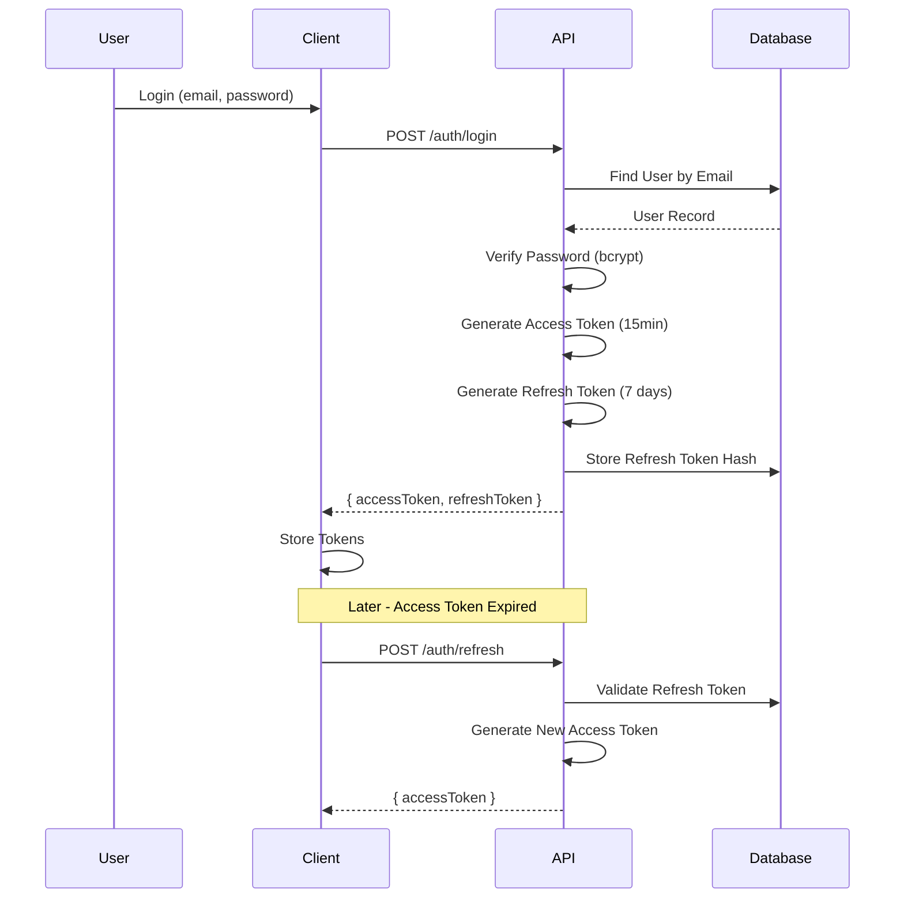

---

## 6. Infrastructure Architecture

### 6.1 Development Environment

```mermaid
flowchart LR
    subgraph Local["💻 Local Development"]
        DevFrontend["Next.js Dev Server<br/>:3001"]
        DevBackend["Express Dev Server<br/>:3000"]
        DevDB["PostgreSQL<br/>(Docker)<br/>:5432"]
        DevRedis["Redis<br/>(Docker)<br/>:6379"]
    end

    DevFrontend --> DevBackend
    DevBackend --> DevDB
    DevBackend --> DevRedis
```

### 6.2 Production Environment (Recommended)

```mermaid
flowchart TB
    subgraph Cloud["☁️ Cloud Infrastructure"]
        subgraph CDN_Layer["CDN Layer"]
            Vercel["Vercel Edge<br/>(Next.js)"]
            CloudflareCDN["Cloudflare CDN<br/>(Static Assets)"]
        end

        subgraph Compute["Compute Layer"]
            Railway["Railway / Render<br/>(API Server)"]
        end

        subgraph Data["Data Layer"]
            NeonDB["Neon PostgreSQL<br/>(Serverless)"]
            UpstashRedis["Upstash Redis<br/>(Serverless)"]
            CloudinaryS3["Cloudinary / S3<br/>(Images)"]
        end

        subgraph External["External Services"]
            StripeCloud["Stripe"]
            PrintfulCloud["Printful"]
            SendGridCloud["SendGrid"]
            SentryCloud["Sentry"]
        end
    end

    Internet["🌐 Internet"] --> CDN_Layer
    CDN_Layer --> Compute
    Compute --> Data
    Compute --> External
```

---

## 7. Module Dependency Diagram

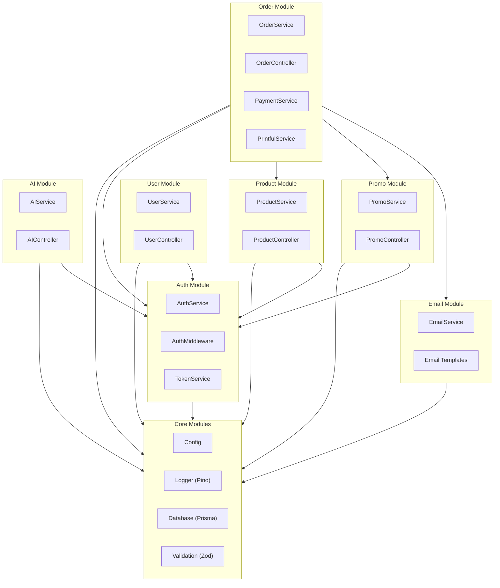

---

## 8. API Architecture

### 8.1 API Versioning Strategy

```
Base URL: /api/v1

Versioning: URL Path versioning
- Current: v1
- Future versions: v2, v3, etc.
```

### 8.2 Endpoint Structure

```
/api/v1
├── /auth
│   ├── POST /register
│   ├── POST /login
│   ├── POST /refresh
│   ├── POST /logout
│   └── POST /forgot-password
│
├── /users
│   ├── GET /me
│   ├── PATCH /me
│   └── /addresses (CRUD)
│
├── /products
│   ├── GET / (list with filters)
│   ├── GET /:slug
│   ├── POST / (manager+)
│   ├── PATCH /:id (manager+)
│   └── DELETE /:id (admin)
│
├── /product-types
│   └── GET /
│
├── /orders
│   ├── POST / (create)
│   ├── GET /:id
│   ├── GET /track/:orderNumber
│   └── GET / (admin: list all)
│
├── /promo-codes
│   ├── POST /validate
│   └── CRUD (marketing+)
│
├── /newsletter
│   └── POST /subscribe
│
├── /contact
│   └── POST /
│
└── /admin
    ├── /users (CRUD)
    ├── /orders (manage)
    └── /dashboard (metrics)
```

---

## 9. Error Handling Architecture

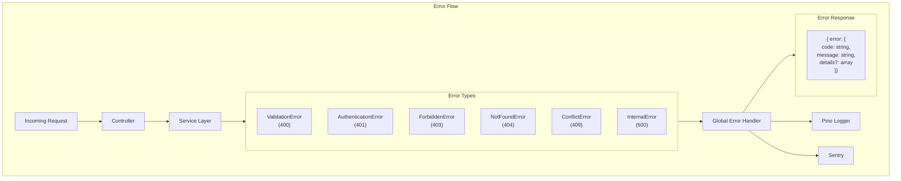

---

## 10. Caching Strategy

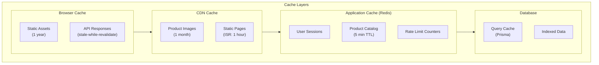

---

## 11. Technology Stack Summary

### 11.1 Backend Stack

| Layer | Technology | Purpose |
|-------|------------|---------|
| Runtime | Node.js 20+ | JavaScript runtime |
| Framework | Express.js | HTTP server framework |
| Language | TypeScript | Type safety |
| ORM | Prisma | Database access & migrations |
| Validation | Zod | Schema validation |
| Logging | Pino + Pino-Pretty | Structured logging |
| HTTP Client | Axios | External API calls |
| Auth | JWT (jsonwebtoken) | Token-based auth |
| Password | Bcrypt | Password hashing |
| Testing | Jest | Unit & integration tests |

### 11.2 Frontend Stack

| Layer | Technology | Purpose |
|-------|------------|---------|
| Framework | Next.js 14+ (App Router) | React framework with SSR/SSG |
| Language | TypeScript | Type safety |
| Styling | Tailwind CSS | Utility-first CSS |
| Components | Shadcn/UI + Radix | Accessible components |
| State | Zustand | Client state management |
| Server State | TanStack Query | Data fetching & caching |
| Forms | React Hook Form + Zod | Form handling |
| HTTP Client | Axios | API calls |
| Testing | Jest + React Testing Library | Unit tests |
| E2E Testing | Playwright | End-to-end tests |

### 11.3 Infrastructure

| Component | Technology | Purpose |
|-----------|------------|---------|
| Database | PostgreSQL 15+ | Primary data store |
| Cache | Redis | Sessions & caching |
| Containers | Docker + Docker Compose | Development environment |
| CI/CD | GitHub Actions | Automated testing & deployment |

---

## 12. Non-Functional Requirements Compliance

| Requirement | Implementation |
|-------------|----------------|
| **Performance** | CDN for images, Redis cache, database indexes, SSG/ISR |
| **Scalability** | Stateless API, horizontal scaling ready |
| **Security** | HTTPS, JWT, input validation, rate limiting, RBAC |
| **SEO** | SSR/SSG, semantic URLs, structured data, sitemap |
| **Accessibility** | WCAG 2.1 Level A, semantic HTML, ARIA |
| **i18n** | JSON-based translations, Accept-Language header |
| **Monitoring** | Sentry for errors, Pino for logging |
| **GDPR** | Cookie consent, data export, soft deletes |

---

*Document version: 1.0*
*Last updated: January 2026*
