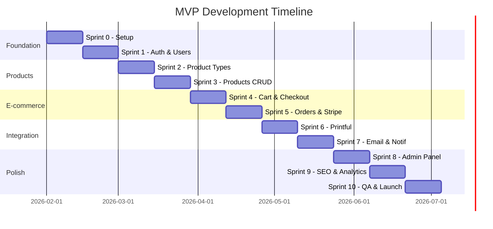

# Development Plan

## 1. Overview

This document outlines the development plan for the Meme Products E-commerce Platform MVP. The plan is organized in sprints, following an incremental delivery approach.

### 1.1 Development Principles

- **TDD (Test-Driven Development)**: Write tests before implementation
- **Incremental Delivery**: Small, focused PRs
- **Type Safety**: Full TypeScript coverage
- **Documentation**: Keep docs updated with code

### 1.2 Sprint Duration

- **Sprint Length**: 2 weeks
- **Total Estimated Sprints**: 8-10 sprints for MVP

---

## 2. Sprint Overview

---

## 3. Sprint Details

### Sprint 0: Project Setup & Infrastructure

**Goal**: Establish project foundation and development environment.

#### Backend Tasks

| ID | Task | Priority | Type |
|----|------|----------|------|
| B0.1 | Initialize Express + TypeScript project | High | Setup |
| B0.2 | Configure Prisma with PostgreSQL | High | Setup |
| B0.3 | Setup Pino logger | High | Setup |
| B0.4 | Configure Zod for env validation | High | Setup |
| B0.5 | Setup Jest for testing | High | Setup |
| B0.6 | Configure ESLint + Prettier | Medium | Setup |
| B0.7 | Create Docker Compose for PostgreSQL + Redis | High | Setup |
| B0.8 | Setup global error handling middleware | High | Core |
| B0.9 | Create base response helpers | Medium | Core |
| B0.10 | Setup health check endpoint | Low | Core |

#### Frontend Tasks

| ID | Task | Priority | Type |
|----|------|----------|------|
| F0.1 | Initialize Next.js 14 + TypeScript (App Router) | High | Setup |
| F0.2 | Configure Tailwind CSS | High | Setup |
| F0.3 | Setup Shadcn/UI | High | Setup |
| F0.4 | Configure Axios client | High | Setup |
| F0.5 | Setup Zustand stores (skeleton) | Medium | Setup |
| F0.6 | Configure TanStack Query | Medium | Setup |
| F0.7 | Setup Jest + React Testing Library | High | Setup |
| F0.8 | Configure Playwright | Medium | Setup |
| F0.9 | Create base layout components (Header, Footer) | Medium | UI |
| F0.10 | Setup ESLint + Prettier | Medium | Setup |

#### Deliverables
- [ ] Working development environment
- [ ] Database connection verified
- [ ] Basic API health endpoint responding
- [ ] Frontend rendering base layout
- [ ] CI pipeline for linting and tests

---

### Sprint 1: Authentication & Users

**Goal**: Implement user authentication and basic user management.

#### Backend Tasks

| ID | Task | Priority | Type |
|----|------|----------|------|
| B1.1 | Create User model and migration | High | Model |
| B1.2 | Implement auth service (register, login, logout) | High | Service |
| B1.3 | Implement JWT token service | High | Service |
| B1.4 | Create auth middleware | High | Middleware |
| B1.5 | Implement refresh token rotation | High | Service |
| B1.6 | Create auth controller and routes | High | Controller |
| B1.7 | Implement password reset flow | Medium | Service |
| B1.8 | Create user profile endpoints (GET /me, PATCH /me) | Medium | Controller |
| B1.9 | Implement role-based access control | High | Middleware |
| B1.10 | Write auth integration tests | High | Test |

#### Frontend Tasks

| ID | Task | Priority | Type |
|----|------|----------|------|
| F1.1 | Create authStore (Zustand) | High | State |
| F1.2 | Implement login page | High | Page |
| F1.3 | Implement registration page | High | Page |
| F1.4 | Implement forgot password page | Medium | Page |
| F1.5 | Create auth service (API calls) | High | Service |
| F1.6 | Setup axios interceptors for JWT | High | Config |
| F1.7 | Implement protected route HOC | High | Component |
| F1.8 | Create user menu component | Medium | Component |
| F1.9 | Write auth component tests | High | Test |
| F1.10 | Implement token refresh logic | High | Service |

#### Deliverables
- [ ] User registration working
- [ ] User login/logout working
- [ ] JWT authentication with refresh tokens
- [ ] Role-based route protection
- [ ] Password reset flow (email pending)

---

### Sprint 2: Product Types & Categories

**Goal**: Implement product type management.

#### Backend Tasks

| ID | Task | Priority | Type |
|----|------|----------|------|
| B2.1 | Create ProductType model and migration | High | Model |
| B2.2 | Implement product type service | High | Service |
| B2.3 | Create product type endpoints (CRUD) | High | Controller |
| B2.4 | Implement i18n support for product type names | Medium | Service |
| B2.5 | Create seed data for product types | High | Data |
| B2.6 | Write product type integration tests | High | Test |

#### Frontend Tasks

| ID | Task | Priority | Type |
|----|------|----------|------|
| F2.1 | Create product types service | High | Service |
| F2.2 | Create product type filter component | High | Component |
| F2.3 | Implement admin product types page | Medium | Page |
| F2.4 | Write product type component tests | Medium | Test |

#### Deliverables
- [ ] Product types CRUD for admin
- [ ] Product type filter on frontend
- [ ] Seeded product types (t-shirt, hoodie, mug, etc.)

---

### Sprint 3: Products CRUD

**Goal**: Implement full product management.

#### Backend Tasks

| ID | Task | Priority | Type |
|----|------|----------|------|
| B3.1 | Create Product, ProductImage, ProductReview models | High | Model |
| B3.2 | Create PriceHistory model | Medium | Model |
| B3.3 | Implement product service (CRUD) | High | Service |
| B3.4 | Implement product listing with filters | High | Service |
| B3.5 | Implement product detail endpoint | High | Controller |
| B3.6 | Implement soft delete for products | Medium | Service |
| B3.7 | Implement product image upload | High | Service |
| B3.8 | Implement product review management | Medium | Service |
| B3.9 | Create admin product endpoints | High | Controller |
| B3.10 | Write product integration tests | High | Test |

#### Frontend Tasks

| ID | Task | Priority | Type |
|----|------|----------|------|
| F3.1 | Create product catalog page | High | Page |
| F3.2 | Implement ProductCard component | High | Component |
| F3.3 | Implement ProductGrid component | High | Component |
| F3.4 | Implement ProductFilters component | High | Component |
| F3.5 | Create product detail page | High | Page |
| F3.6 | Implement image gallery component | Medium | Component |
| F3.7 | Implement reviews display | Medium | Component |
| F3.8 | Create admin products list page | High | Page |
| F3.9 | Create admin product form (create/edit) | High | Page |
| F3.10 | Write product component tests | High | Test |

#### Deliverables
- [ ] Product catalog with pagination
- [ ] Product filtering and sorting
- [ ] Product detail page with images and reviews
- [ ] Admin product management CRUD

---

### Sprint 4: Cart & Checkout UI

**Goal**: Implement shopping cart and checkout flow UI.

#### Backend Tasks

| ID | Task | Priority | Type |
|----|------|----------|------|
| B4.1 | Create Address model and migration | High | Model |
| B4.2 | Implement address service (CRUD for users) | High | Service |
| B4.3 | Create cart validation endpoint | High | Controller |
| B4.4 | Implement promo code validation | High | Service |
| B4.5 | Create order total calculation service | High | Service |
| B4.6 | Write cart/checkout integration tests | High | Test |

#### Frontend Tasks

| ID | Task | Priority | Type |
|----|------|----------|------|
| F4.1 | Create cartStore (Zustand with persistence) | High | State |
| F4.2 | Implement CartDrawer component | High | Component |
| F4.3 | Implement CartItem component | High | Component |
| F4.4 | Create cart page | High | Page |
| F4.5 | Implement checkout page (multi-step) | High | Page |
| F4.6 | Create shipping address form | High | Component |
| F4.7 | Implement promo code input | High | Component |
| F4.8 | Create order summary component | High | Component |
| F4.9 | Implement cross-sell component | Medium | Component |
| F4.10 | Write cart/checkout tests | High | Test |

#### Deliverables
- [ ] Cart functionality (add, remove, update quantity)
- [ ] Persistent cart (localStorage)
- [ ] Checkout flow UI
- [ ] Promo code application

---

### Sprint 5: Orders & Stripe Integration

**Goal**: Complete order creation with payment processing.

#### Backend Tasks

| ID | Task | Priority | Type |
|----|------|----------|------|
| B5.1 | Create Order, OrderItem models | High | Model |
| B5.2 | Implement Stripe integration service | High | Integration |
| B5.3 | Implement order creation service | High | Service |
| B5.4 | Create order number generation | High | Service |
| B5.5 | Implement Stripe webhook handler | High | Controller |
| B5.6 | Implement order status updates | High | Service |
| B5.7 | Create order endpoints (create, get, list) | High | Controller |
| B5.8 | Implement order tracking endpoint | High | Controller |
| B5.9 | Implement guest checkout flow | High | Service |
| B5.10 | Write order integration tests | High | Test |

#### Frontend Tasks

| ID | Task | Priority | Type |
|----|------|----------|------|
| F5.1 | Integrate Stripe Elements | High | Integration |
| F5.2 | Implement payment form component | High | Component |
| F5.3 | Create order confirmation page | High | Page |
| F5.4 | Implement order tracking page | High | Page |
| F5.5 | Create user orders list page | Medium | Page |
| F5.6 | Implement order detail page | Medium | Page |
| F5.7 | Handle payment errors | High | Component |
| F5.8 | Write Stripe integration tests | High | Test |

#### Deliverables
- [ ] Complete checkout flow with Stripe
- [ ] Order creation and confirmation
- [ ] Order tracking by order number
- [ ] User order history

---

### Sprint 6: Printful Integration

**Goal**: Integrate Printful for production and shipping.

#### Backend Tasks

| ID | Task | Priority | Type |
|----|------|----------|------|
| B6.1 | Implement Printful API client | High | Integration |
| B6.2 | Create product sync with Printful | High | Service |
| B6.3 | Generate mockups from Printful | High | Service |
| B6.4 | Submit orders to Printful | High | Service |
| B6.5 | Implement Printful webhook handler | High | Controller |
| B6.6 | Update order status from Printful events | High | Service |
| B6.7 | Implement shipping cost calculation | High | Service |
| B6.8 | Write Printful integration tests | High | Test |

#### Frontend Tasks

| ID | Task | Priority | Type |
|----|------|----------|------|
| F6.1 | Display mockup previews in product form | High | Component |
| F6.2 | Show shipping estimates | Medium | Component |
| F6.3 | Display tracking information | High | Component |
| F6.4 | Write integration tests | Medium | Test |

#### Deliverables
- [ ] Product sync with Printful
- [ ] Automatic order submission to Printful
- [ ] Shipping tracking integration
- [ ] Mockup generation

---

### Sprint 7: Email & Notifications

**Goal**: Implement transactional emails and notifications.

#### Backend Tasks

| ID | Task | Priority | Type |
|----|------|----------|------|
| B7.1 | Implement email service (SendGrid/Resend) | High | Integration |
| B7.2 | Create email templates (order confirmation) | High | Template |
| B7.3 | Create email templates (shipping notification) | High | Template |
| B7.4 | Create email templates (password reset) | High | Template |
| B7.5 | Implement newsletter subscription | Medium | Service |
| B7.6 | Implement contact form handler | Medium | Service |
| B7.7 | Create post-purchase follow-up emails | Medium | Service |
| B7.8 | Write email service tests | High | Test |

#### Frontend Tasks

| ID | Task | Priority | Type |
|----|------|----------|------|
| F7.1 | Create newsletter subscription component | Medium | Component |
| F7.2 | Create contact form page | Medium | Page |
| F7.3 | Implement email preference UI | Low | Component |
| F7.4 | Write component tests | Medium | Test |

#### Deliverables
- [ ] Order confirmation emails
- [ ] Shipping notification emails
- [ ] Password reset emails
- [ ] Newsletter subscription
- [ ] Contact form

---

### Sprint 8: Admin Panel

**Goal**: Complete admin panel functionality.

#### Backend Tasks

| ID | Task | Priority | Type |
|----|------|----------|------|
| B8.1 | Implement admin dashboard metrics | High | Service |
| B8.2 | Create admin user management endpoints | High | Controller |
| B8.3 | Implement order management endpoints | High | Controller |
| B8.4 | Create promo code CRUD endpoints | High | Controller |
| B8.5 | Implement AI image generation endpoint | Medium | Integration |
| B8.6 | Implement AI review generation endpoint | Medium | Integration |
| B8.7 | Write admin endpoint tests | High | Test |

#### Frontend Tasks

| ID | Task | Priority | Type |
|----|------|----------|------|
| F8.1 | Create admin dashboard with metrics | High | Page |
| F8.2 | Implement admin orders management | High | Page |
| F8.3 | Implement admin users management | High | Page |
| F8.4 | Create promo code management page | High | Page |
| F8.5 | Implement AI image generation UI | Medium | Component |
| F8.6 | Implement AI review generation UI | Medium | Component |
| F8.7 | Write admin page tests | High | Test |

#### Deliverables
- [ ] Admin dashboard with KPIs
- [ ] Order management
- [ ] User management
- [ ] Promo code management
- [ ] AI content generation tools

---

### Sprint 9: SEO & Analytics

**Goal**: Optimize for search engines and implement analytics.

#### Backend Tasks

| ID | Task | Priority | Type |
|----|------|----------|------|
| B9.1 | Implement sitemap.xml generation | High | SEO |
| B9.2 | Create robots.txt endpoint | Medium | SEO |
| B9.3 | Add structured data to API responses | High | SEO |
| B9.4 | Implement URL slug validation | Medium | Service |

#### Frontend Tasks

| ID | Task | Priority | Type |
|----|------|----------|------|
| F9.1 | Implement dynamic meta tags | High | SEO |
| F9.2 | Add Open Graph tags | High | SEO |
| F9.3 | Implement structured data (JSON-LD) | High | SEO |
| F9.4 | Integrate Google Analytics 4 | High | Analytics |
| F9.5 | Implement e-commerce tracking events | High | Analytics |
| F9.6 | Add cookie consent banner | High | Legal |
| F9.7 | Create legal pages (privacy, terms) | High | Legal |
| F9.8 | Performance optimization (images, fonts) | High | Performance |
| F9.9 | Write SEO-related tests | Medium | Test |

#### Deliverables
- [ ] SEO-optimized pages
- [ ] Google Analytics tracking
- [ ] E-commerce event tracking
- [ ] Cookie consent
- [ ] Legal pages

---

### Sprint 10: QA & Launch Preparation

**Goal**: Final testing, bug fixes, and launch preparation.

#### Tasks

| ID | Task | Priority | Type |
|----|------|----------|------|
| Q10.1 | Complete E2E test suite | High | Test |
| Q10.2 | Security audit and fixes | High | Security |
| Q10.3 | Performance testing and optimization | High | Performance |
| Q10.4 | Accessibility audit (WCAG 2.1 A) | High | Accessibility |
| Q10.5 | Cross-browser testing | High | Test |
| Q10.6 | Mobile responsiveness review | High | Test |
| Q10.7 | Setup production environment | High | DevOps |
| Q10.8 | Configure monitoring (Sentry) | High | DevOps |
| Q10.9 | Setup backup procedures | High | DevOps |
| Q10.10 | Create deployment documentation | High | Docs |
| Q10.11 | Load testing | Medium | Test |
| Q10.12 | Bug fixing from QA | High | Bug Fix |

#### Deliverables
- [ ] All E2E tests passing
- [ ] Security vulnerabilities addressed
- [ ] Performance benchmarks met
- [ ] WCAG 2.1 Level A compliance
- [ ] Production environment ready
- [ ] Monitoring configured
- [ ] Launch checklist complete

---

## 4. Risk Assessment

| Risk | Probability | Impact | Mitigation |
|------|-------------|--------|------------|
| Printful API changes | Low | High | Abstract integration, version lock |
| Stripe integration complexity | Medium | High | Early spike, use official SDK |
| Performance issues with images | Medium | Medium | CDN, image optimization early |
| Scope creep | High | Medium | Strict MVP definition, backlog |
| Third-party service downtime | Low | High | Graceful degradation, retry logic |

---

## 5. Definition of Done

### For Each Task
- [ ] Code written and self-reviewed
- [ ] Unit tests written and passing
- [ ] Integration tests written (if applicable)
- [ ] TypeScript types complete
- [ ] No ESLint errors
- [ ] Documentation updated (if API change)
- [ ] PR created and reviewed
- [ ] Merged to develop branch

### For Each Sprint
- [ ] All tasks completed
- [ ] All tests passing in CI
- [ ] Demo to stakeholders
- [ ] Sprint retrospective completed
- [ ] Backlog groomed for next sprint

---

## 6. Technical Debt Tracking

| Item | Sprint | Priority | Notes |
|------|--------|----------|-------|
| Add Redis caching | Post-MVP | Medium | For performance optimization |
| Add message queue | Post-MVP | Medium | For async email/webhook processing |
| Add CDN for images | Sprint 3 | High | Required for performance |
| Database indexes optimization | Sprint 10 | High | Based on query patterns |

---

## 7. Post-MVP Roadmap

### Version 1.1
- Wishlist / Favorites feature
- "Notify when available" feature

### Version 1.2
- Product bundles
- Scarcity timer
- Referral program

### Version 1.x (Technical)
- Redis caching layer
- Message queue (Bull/Redis)
- Push notifications infrastructure

---

*Document version: 1.0*
*Last updated: January 2026*
